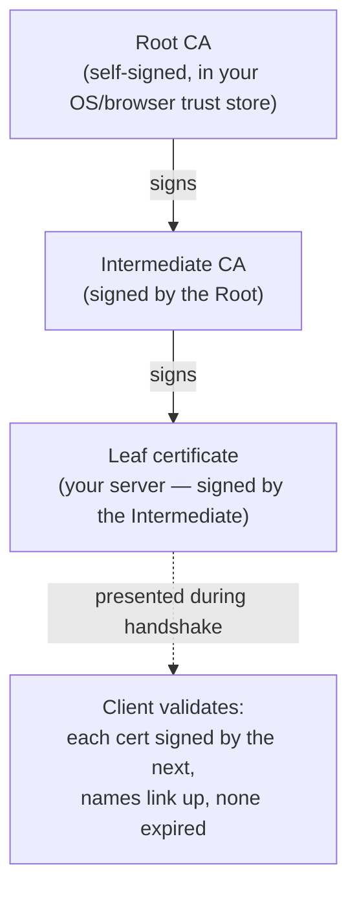
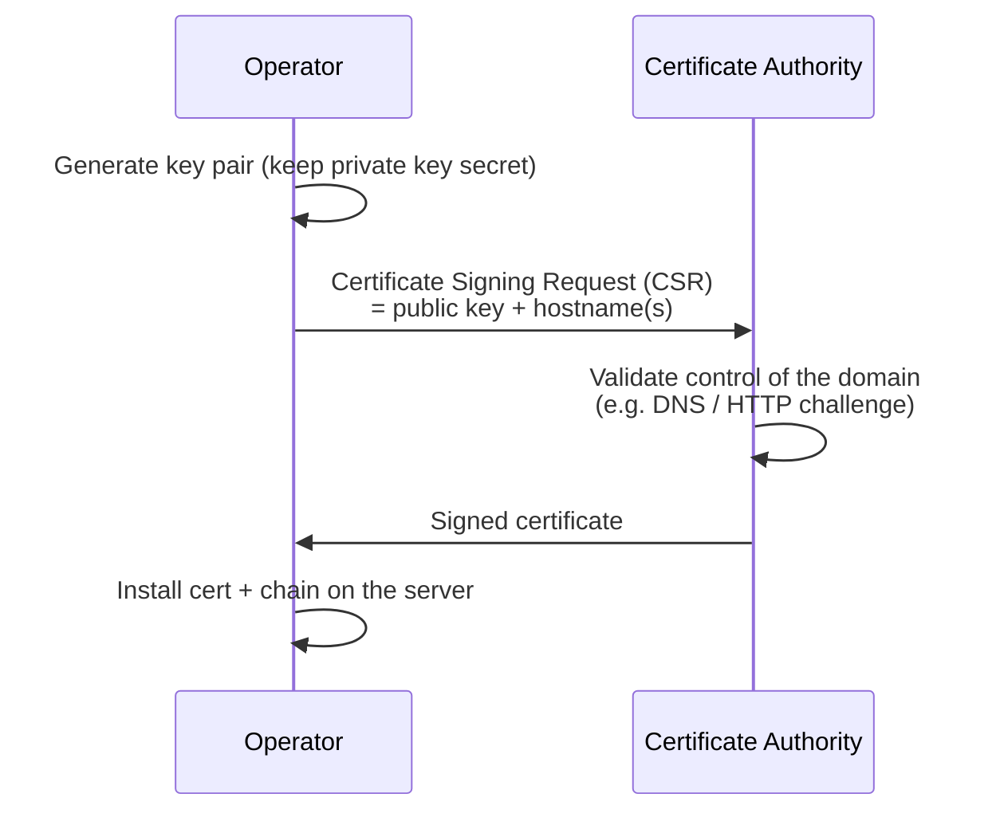

# Certificates & PKI

When a server proves its identity during the [TLS handshake](how-tls-works.md), it presents an **X.509 certificate**. This page explains what's inside that certificate, how your client decides to trust it, and the system of authorities — **Public Key Infrastructure (PKI)** — that makes the whole thing work.

## What is a certificate?

A certificate is a signed statement binding a **public key** to an **identity** (one or more hostnames). It's the digital equivalent of a passport: a trusted authority vouches that this key belongs to this entity.

The fields CertMonitor surfaces from a certificate:

| Field | What it is | Validator |
|---|---|---|
| **Subject** | Who the cert is for (the hostname/org) | [Hostname](../validators/hostname.md) |
| **Subject Alternative Names** | All hostnames/IPs the cert is valid for | [SubjectAltNames](../validators/subject_alt_names.md) |
| **Issuer** | The CA that signed it | [RootCertificate](../validators/root_certificate.md) |
| **Validity period** | `notBefore` / `notAfter` dates | [Expiration](../validators/expiration.md) |
| **Public key** | The key being vouched for (RSA, EC, or PQ) | [KeyInfo](../validators/key_info.md) |
| **Signature** | The CA's cryptographic signature over all of the above | [Chain](../validators/chain.md), [PqSignature](../validators/pq_signature.md) |

Crucially, the certificate carries only the **public** key. The matching **private** key never leaves the server — and `CertificateVerify` in the handshake is the server proving it holds that private key.

## The chain of trust

Your browser doesn't trust the server's certificate directly. Instead it follows a **chain** up to a root it already trusts:

- The **root CA** is self-signed and ships pre-installed in your operating system or browser **trust store**. You trust it implicitly.
- The root signs one or more **intermediate CAs** (kept offline for safety; the intermediates do the day-to-day issuing).
- An intermediate signs the **leaf** — the certificate your server presents.

To trust the leaf, the client verifies an unbroken chain: each certificate is validly signed by the next one up, the names link correctly (each issuer matches the parent's subject), and nothing in the chain is expired or revoked. CertMonitor's [Chain](../validators/chain.md) validator inspects exactly this structure.

!!! tip "Servers usually don't send the root"
    A well-configured server sends the leaf **and** intermediates, but not the root — the client already has the root in its trust store. So a chain that "doesn't include the root" is normal, not broken. CertMonitor's chain validator accounts for this.

## How a certificate gets issued

The operator generates a key pair, sends the public half plus the desired hostnames to a CA as a **CSR**, the CA validates that the requester actually controls those domains, and then signs and returns the certificate. Automated CAs like Let's Encrypt do this in seconds via the ACME protocol.

## Trust is a moving target

PKI assumes the signature algorithms protecting these certificates are unbreakable. That assumption is what a quantum computer threatens — which is why the migration to post-quantum certificate keys and signatures is now underway. See [Post-Quantum Cryptography](post-quantum.md).

## Next steps

- [How TLS & HTTPS Work](how-tls-works.md) — where the certificate fits in the handshake.
- [Post-Quantum Cryptography](post-quantum.md) — the coming change to certificate keys and signatures.
- [Chain validator](../validators/chain.md) — inspect chain structure in practice.
