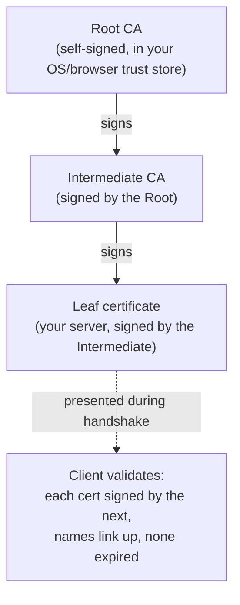
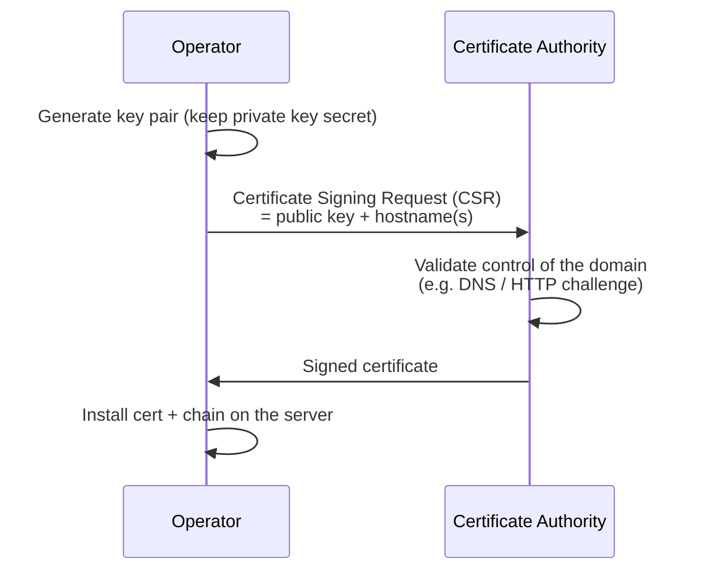

# Certificates & PKI

When a server proves its identity during the [TLS handshake](how-tls-works.md), it presents an **X.509 certificate**. This page explains what's inside that certificate, how your client decides to trust it, and the system of authorities (**Public Key Infrastructure (PKI)**) that makes the whole thing work.

## What is a certificate?

A certificate is a signed statement binding a **public key** to an **identity** (one or more hostnames). It's the digital equivalent of a passport: a trusted authority vouches that this key belongs to this entity.

The fields CertMonitor surfaces from a certificate:

| Field | What it is | Validator |
|---|---|---|
| **Subject** | Descriptive identity fields, including an informational Common Name | [Hostname](../validators/hostname.md) reports CN separately |
| **Subject Alternative Names** | DNS/IP identities asserted by the certificate | [Hostname](../validators/hostname.md) for the primary name; [SubjectAltNames](../validators/subject_alt_names.md) for alternates |
| **Issuer** | The claimed signer; the name alone is not proof of trust | [RootCertificate](../validators/root_certificate.md) verifies trust |
| **Validity period** | `notBefore` / `notAfter` dates | [Expiration](../validators/expiration.md) |
| **Public key** | The key being vouched for (RSA, EC, or PQ) | [KeyInfo](../validators/key_info.md) |
| **Signature** | The CA's cryptographic signature over all of the above | [RootCertificate](../validators/root_certificate.md) verifies trust; [PqSignature](../validators/pq_signature.md) classifies algorithms |

Crucially, the certificate carries only the **public** key. The matching **private** key must stay secret. In a certificate-authenticated TLS 1.3 handshake, `CertificateVerify` proves the server holds it.

## The chain of trust

Your browser doesn't trust the server's certificate directly. Instead it follows a **chain** up to a root it already trusts:

```mermaid
flowchart TD
    R["Root CA<br/>(self-signed, in your OS/browser trust store)"]
    I["Intermediate CA<br/>(signed by the Root)"]
    L["Leaf certificate<br/>(your server, signed by the Intermediate)"]
    R -->|signs| I
    I -->|signs| L
    L -.->|presented during handshake| B["Client validates:<br/>each cert signed by the next,<br/>names link up, none expired"]
```

- A **root CA** becomes trusted because your client or administrator includes it in a **trust store**. A self-signature by itself does not make a certificate trustworthy.
- The root signs one or more **intermediate CAs**. Root private keys are commonly kept offline; intermediates handle day-to-day issuance.
- An intermediate signs the **leaf**, the certificate your server presents.

To trust the leaf, a client builds and verifies a path to a configured trust anchor, checking signatures, validity periods, and certificate constraints. Hostname matching and revocation policy are additional parts of validating a connection. CertMonitor's [RootCertificate](../validators/root_certificate.md) checks trust using OpenSSL, [Hostname](../validators/hostname.md) checks identity, and [Chain](../validators/chain.md) inspects the presented structure. CertMonitor does not check revocation.

!!! tip "Servers usually don't send the root"
    A well-configured server sends the leaf **and** intermediates, but not the root. The client already has the root in its trust store, so a chain that "doesn't include the root" is normal, not broken. CertMonitor's chain validator accounts for this.

## How a certificate gets issued

```mermaid
sequenceDiagram
    participant O as Operator
    participant CA as Certificate Authority
    O->>O: Generate key pair (keep private key secret)
    O->>CA: Certificate Signing Request (CSR)<br/>= public key + hostname(s)
    CA->>CA: Validate control of the domain<br/>(e.g. DNS / HTTP challenge)
    CA->>O: Signed certificate
    O->>O: Install cert + chain on the server
```

The operator generates a key pair, sends the public half plus the desired hostnames to a CA as a **CSR**, the CA validates that the requester actually controls those domains, and then signs and returns the certificate. Automated CAs like Let's Encrypt do this in seconds via the ACME protocol.

## Trust is a moving target

PKI depends on signature algorithms remaining hard to forge. That assumption is what a quantum computer threatens, which is why the migration to post-quantum certificate keys and signatures is now underway. See [Post-Quantum Cryptography](post-quantum.md).

## Next steps

- [How TLS & HTTPS Work](how-tls-works.md): where the certificate fits in the handshake.
- [Post-Quantum Cryptography](post-quantum.md): the coming change to certificate keys and signatures.
- [Chain validator](../validators/chain.md): inspect chain structure in practice.
