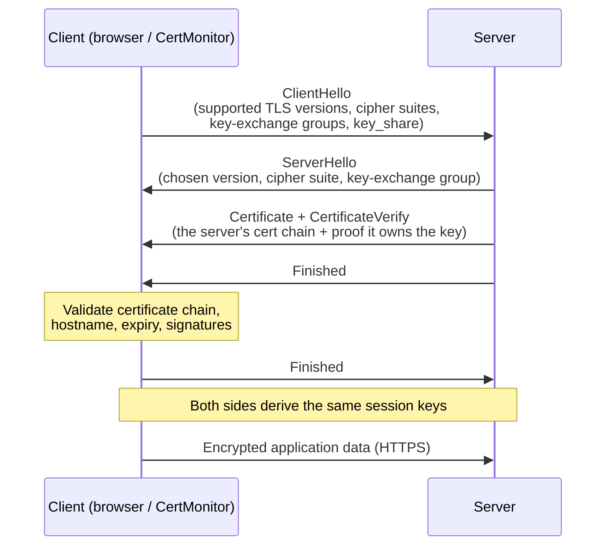

# How TLS & HTTPS Work

HTTPS is just HTTP carried over **TLS** (Transport Layer Security). TLS gives a connection three guarantees:

- **Encryption** — nobody between you and the server can read the traffic.
- **Authentication** — you're really talking to the server you think you are (this is what certificates prove).
- **Integrity** — the data can't be tampered with in transit without detection.

CertMonitor inspects the artifacts of this process — the certificate, the chain, the negotiated protocol version, the cipher suite, and the key-exchange group — and reports on their health. This page explains what those artifacts are and where they come from.

!!! note "\"SSL\" vs \"TLS\""
    You'll see both terms everywhere, often interchangeably. **SSL** (Secure Sockets Layer) is the original 1990s protocol; it was renamed **TLS** when standardized, and every SSL version (1.0–3.0) is now obsolete and insecure. What runs today is TLS 1.2 and TLS 1.3 — but the old name stuck, which is why we still say "SSL certificate" and "SSL/TLS." CertMonitor uses TLS in practice and can still *detect* legacy SSL/older TLS so you can flag endpoints that haven't moved on.

## The TLS 1.3 handshake

Before any application data flows, the client and server perform a **handshake** to agree on keys and verify identity. TLS 1.3 (the modern default) completes this in a single round trip:

Step by step:

1. **ClientHello** — the client offers what it supports: TLS versions, cipher suites, and key-exchange groups, along with a `key_share` (its half of the key agreement).
2. **ServerHello** — the server picks one option from each list and sends its own `key_share`. After this exchange, both sides can derive the shared session keys.
3. **Certificate** — the server presents its certificate chain (leaf → intermediates), and `CertificateVerify` proves it holds the matching private key.
4. **Validation** — the client checks the certificate: is it for this hostname? expired? issued by a trusted CA? is the chain intact?
5. **Finished** — both sides confirm the handshake wasn't tampered with, then switch to encrypted application data.

!!! info "Where CertMonitor looks"
    CertMonitor performs this handshake and then inspects each artifact: the **certificate** (→ [Expiration](../validators/expiration.md), [Hostname](../validators/hostname.md), [KeyInfo](../validators/key_info.md), [Chain](../validators/chain.md)), the **negotiated protocol** (→ [TLSVersion](../validators/tls_version.md)), the **cipher suite** (→ [WeakCipher](../validators/weak_cipher.md)), and the **key-exchange group** (→ [PqKeyExchange](../validators/pq_key_exchange.md)).

## The two halves: key exchange vs. signatures

A subtle but important point — a TLS session uses cryptography in two distinct roles, and they have very different security timelines:

| Role | What it does | Algorithm examples |
|---|---|---|
| **Key exchange (KEM)** | Agrees on the symmetric session key | ECDH (`x25519`), or post-quantum `X25519MLKEM768` |
| **Signatures** | Authenticate the server (cert + handshake) | RSA, ECDSA, or post-quantum ML-DSA |

This split matters enormously for post-quantum security: **key exchange is the urgent problem** (an attacker can record traffic today and decrypt it later), while signatures only need to be quantum-safe before a quantum computer actually exists. See [Post-Quantum Cryptography](post-quantum.md) for why.

## Why TLS 1.3 over older versions

TLS 1.0 and 1.1 are deprecated — they permit weak ciphers and have known weaknesses. TLS 1.2 is still acceptable when configured well; TLS 1.3 removed the legacy footguns entirely, made forward secrecy mandatory, and cut the handshake to one round trip. CertMonitor's [TLSVersion](../validators/tls_version.md) validator flags anything below TLS 1.2 by default.

## Next steps

- [Certificates & PKI](certificates-and-pki.md) — what the server's certificate actually proves, and how trust is established.
- [Post-Quantum Cryptography](post-quantum.md) — the looming change to TLS key exchange and signatures.
