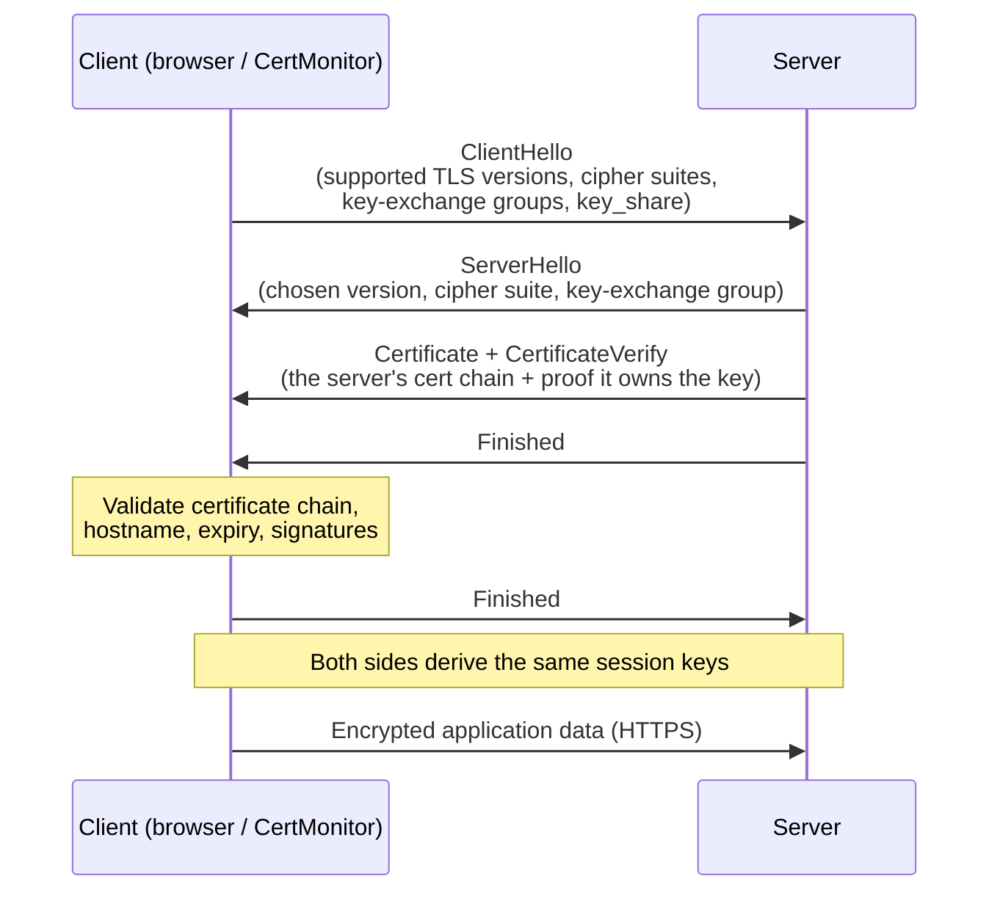

# How TLS & HTTPS Work

HTTPS is just HTTP carried over **TLS** (Transport Layer Security). When you connect over TLS, you get three things:

* **Encryption.** Nobody between you and the server can read the traffic.
* **Authentication.** You're really talking to the server you think you are. This is what certificates prove.
* **Integrity.** The data can't be tampered with along the way without you noticing.

CertMonitor looks at the artifacts this process produces (the certificate, the chain, the TLS version, the cipher suite, and the key-exchange group) and tells you whether they're healthy. So before you use the validators, it helps to know what those artifacts are and where they come from.

!!! note "\"SSL\" or \"TLS\"?"
    You'll see both words, often for the same thing. **SSL** (Secure Sockets Layer) is the original protocol from the 1990s. It was renamed **TLS** when it was standardized, and every SSL version is now obsolete and insecure. What actually runs today is TLS 1.2 and TLS 1.3. The old name simply stuck, which is why people still say "SSL certificate." CertMonitor speaks TLS in practice, and it can still *detect* legacy SSL so you can flag servers that haven't moved on.

## The TLS 1.3 handshake

Before any of your application data is sent, the client and the server run a **handshake**. This is where they agree on keys and check identity. With TLS 1.3 (the modern default) it takes a single round trip.

Here's what's happening, step by step:

1. **ClientHello.** The client says what it supports: TLS versions, cipher suites, and key-exchange groups. It also sends a `key_share`, which is its half of the key agreement.
2. **ServerHello.** The server picks one option from each list and sends back its own `key_share`. At this point both sides can compute the same shared session keys.
3. **Certificate.** The server presents its certificate chain (the leaf plus any intermediates), and `CertificateVerify` proves it actually holds the matching private key.
4. **Validation.** The client checks that certificate. Is it for this hostname? Is it expired? Was it issued by a trusted CA? Is the chain intact?
5. **Finished.** Both sides confirm nothing was tampered with, and then they switch to encrypted application data.

!!! info "Where CertMonitor looks"
    CertMonitor runs this handshake and then inspects each artifact. The **certificate** feeds [Expiration](../validators/expiration.md), [Hostname](../validators/hostname.md), [KeyInfo](../validators/key_info.md), and [Chain](../validators/chain.md). The **negotiated protocol** feeds [TLSVersion](../validators/tls_version.md). The **cipher suite** feeds [WeakCipher](../validators/weak_cipher.md). And the **key-exchange group** feeds [PqKeyExchange](../validators/pq_key_exchange.md).

## Two jobs: key exchange and signatures

Here's a detail that turns out to matter a lot. A TLS session uses cryptography for two different jobs, and the two have very different security timelines.

| Job | What it does | Examples |
|---|---|---|
| **Key exchange (KEM)** | Agrees on the symmetric session key | ECDH (`x25519`), or post-quantum `X25519MLKEM768` |
| **Signatures** | Authenticate the server (certificate + handshake) | RSA, ECDSA, or post-quantum ML-DSA |

Why does the split matter? Because of post-quantum security. **Key exchange is the urgent problem.** An attacker can record your encrypted traffic today and decrypt it later, once a quantum computer exists. Signatures only need to be quantum-safe before such a computer actually arrives, since you can't forge a signature on a handshake that already happened. The [Post-Quantum Cryptography](post-quantum.md) page digs into this.

## Why TLS 1.3 over older versions

TLS 1.0 and 1.1 are deprecated. They allow weak ciphers and have known weaknesses, so you don't want them. TLS 1.2 is still fine when it's configured well. TLS 1.3 went further: it removed the legacy footguns, made forward secrecy mandatory, and trimmed the handshake to one round trip. By default, CertMonitor's [TLSVersion](../validators/tls_version.md) validator flags anything below TLS 1.2.

## Next steps

* [Certificates & PKI](certificates-and-pki.md), to see what the server's certificate actually proves and how trust is established.
* [Post-Quantum Cryptography](post-quantum.md), for the coming change to TLS key exchange and signatures.
