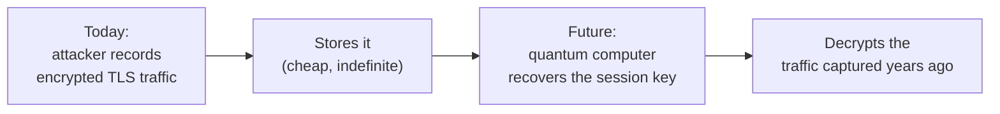
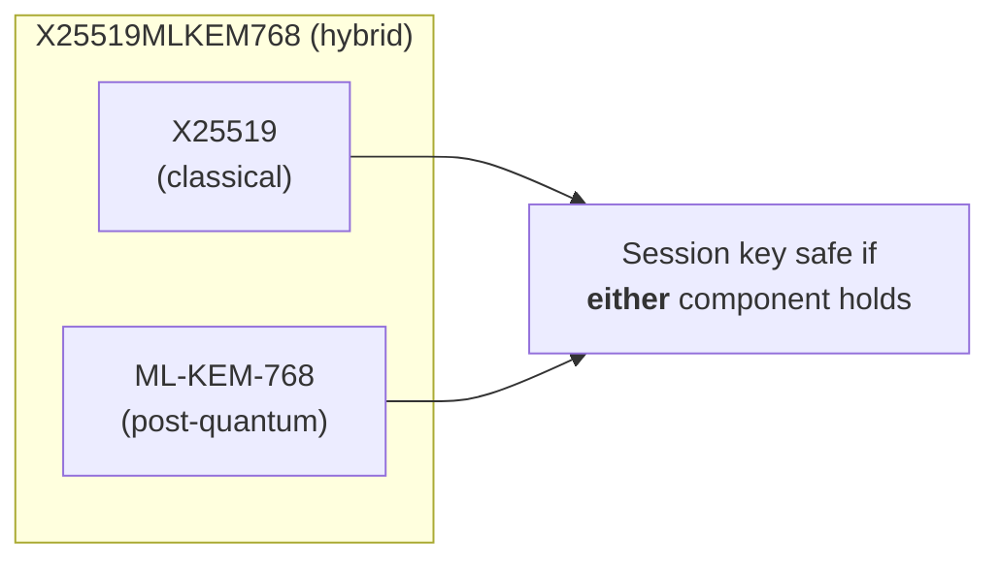

# Post-Quantum Cryptography

The encryption that protects TLS today relies on math that's hard for *classical* computers: factoring large numbers (RSA) and the elliptic-curve discrete log problem (ECDH/ECDSA). A sufficiently large **quantum computer** running **Shor's algorithm** would solve both efficiently, breaking essentially all of today's public-key cryptography.

That machine doesn't exist yet. But the migration has already started, and for one class of risk, **waiting is not safe**.

## Harvest now, decrypt later

The urgent threat isn't a future quantum computer decrypting a future connection. It's this:



This is **harvest-now-decrypt-later (HNDL)**. An adversary captures encrypted traffic *today* and simply waits. The moment a capable quantum computer arrives, everything they stored becomes readable, retroactively. Any data with a long confidentiality lifetime (health records, state secrets, financial data, credentials) is already at risk *right now*, even though the quantum computer is years away.

!!! danger "Why key exchange is the emergency"
    HNDL only threatens the **key exchange** half of TLS. That's why upgrading key exchange to post-quantum is urgent and already deploying at scale, while post-quantum *signatures* can wait until quantum computers are actually imminent. You can't retroactively forge a signature on a connection that already happened.

## The two halves, two timelines

Recall from [How TLS Works](how-tls-works.md) that a session uses cryptography in two roles:

| Role | Quantum risk | Urgency | CertMonitor validator |
|---|---|---|---|
| **Key exchange (KEM)** | HNDL: harvest today, decrypt later | **Now** (already deploying) | [PqKeyExchange](../validators/pq_key_exchange.md) |
| **Signatures** (certs) | Forgery, but only once quantum computers exist | Later, but plan ahead | [PqSignature](../validators/pq_signature.md), [PqChain](../validators/pq_chain.md) |

## The NIST standards

In 2024 NIST finalized the first post-quantum standards, all based on math believed hard even for quantum computers (mostly structured lattices):

| Standard | Algorithm | Role |
|---|---|---|
| **FIPS 203** | **ML-KEM** (formerly Kyber) | Key encapsulation (key exchange) |
| **FIPS 204** | **ML-DSA** (formerly Dilithium) | Digital signatures |
| **FIPS 205** | **SLH-DSA** (SPHINCS+) | Hash-based signatures (conservative backup) |

CertMonitor recognizes all of these (and the draft composite variants). Its post-quantum algorithm table is the single source of truth shared between the Rust parser and the Python validators.

## Hybrids: the pragmatic present

Nobody fully trusts brand-new cryptography overnight. So real-world deployments use **hybrids**: a classical algorithm and a post-quantum one combined, so the connection is safe as long as *either* holds. The dominant TLS 1.3 key-exchange group today is:

```
X25519MLKEM768  =  X25519 (classical ECDH)  +  ML-KEM-768 (post-quantum)
```

Chrome, Cloudflare, Google, and others have deployed this widely. **CertMonitor treats hybrids as post-quantum**; requiring pure PQ today would fail every real server.



## The migration challenges

Post-quantum isn't a drop-in swap:

- **Bigger keys and signatures.** ML-KEM and ML-DSA keys/signatures are kilobytes, not bytes. They inflate handshakes, certificates, and chains, stressing buffers and MTUs that assumed small classical values.
- **Staged rollout.** Key exchange leads; certificate signatures follow. Within a chain, the leaf, intermediates, and root migrate independently and over years, and root CAs migrate last.
- **Standards still settling.** Composite (hybrid) certificate formats are still in draft; codepoints and OIDs shift.
- **Visibility gap.** Standard tooling (including Python's `ssl` module) doesn't even expose the negotiated key-exchange group, so you can't manage what you can't measure.

## How CertMonitor helps

CertMonitor closes the visibility gap on both halves:

- **[PqKeyExchange](../validators/pq_key_exchange.md)** reads the negotiated TLS 1.3 group directly off the wire (via a Rust probe, since `ssl` won't tell you) and reports whether your sessions are HNDL-safe today.
- **[PqSignature](../validators/pq_signature.md)** and **[PqChain](../validators/pq_chain.md)** report the post-quantum posture of the leaf certificate and the full chain as CAs roll out ML-DSA / SLH-DSA.


```python
from certmonitor import CertMonitor

with CertMonitor("cloudflare.com", enabled_validators=["pq_key_exchange"]) as monitor:
    monitor.get_cert_info()
    print(monitor.validate()["pq_key_exchange"])
# {'kem_id': 4588, 'kem_name': 'X25519MLKEM768', 'kem_kind': 'hybrid_pq',
#  'is_pq': True, 'is_valid': True}
```

Use it to inventory where you stand, prioritize HNDL-exposed endpoints, and track quantum-safe migration over time.

## Next steps

- [PqKeyExchange validator](../validators/pq_key_exchange.md): the harvest-now-decrypt-later check.
- [PqSignature](../validators/pq_signature.md) · [PqChain](../validators/pq_chain.md): certificate-side posture.
- [How TLS & HTTPS Work](how-tls-works.md) · [Certificates & PKI](certificates-and-pki.md): the foundations.
