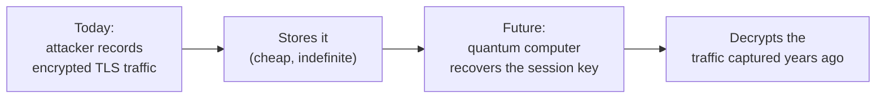
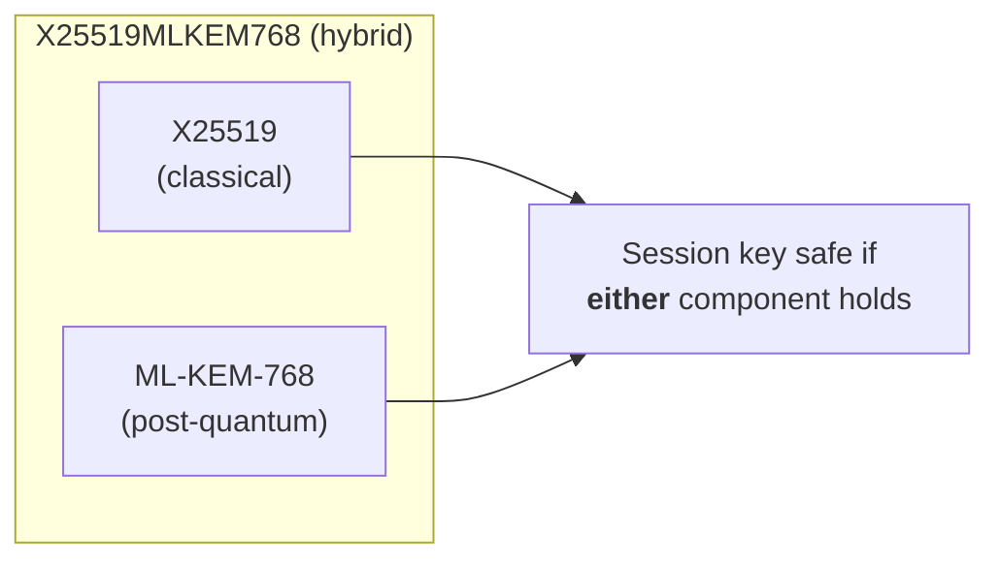

# Post-Quantum Cryptography

Widely used public-key algorithms in TLS rely on math that's hard for *classical* computers: factoring large numbers (RSA) and the elliptic-curve discrete log problem (ECDH/ECDSA). A sufficiently large **quantum computer** running **Shor's algorithm** would solve both efficiently, breaking essentially all of today's public-key cryptography.

The migration is motivated by a future cryptographically relevant quantum computer. For data that must stay confidential for many years, the planning horizon starts now.

## Harvest now, decrypt later

The urgent threat isn't a future quantum computer decrypting a future connection. It's this:


```mermaid
flowchart LR
    A["Today:<br/>attacker records<br/>encrypted TLS traffic"] --> B["Stores it<br/>(cheap, indefinite)"]
    B --> C["Future:<br/>quantum computer<br/>recovers the session key"]
    C --> D["Decrypts the<br/>traffic captured years ago"]
```

This is **harvest-now-decrypt-later (HNDL)**. An adversary captures encrypted traffic *today* and simply waits. Recorded sessions that rely on vulnerable key exchange could become readable later. Any data with a long confidentiality lifetime (health records, state secrets, financial data, credentials) is already at risk *right now*, without needing to predict an exact arrival date.

!!! danger "Why key exchange is the emergency"
    For recorded TLS sessions, HNDL motivates upgrading **key exchange**. Signature migration addresses a different risk: future forgery. It still needs planning now, because certificates, trust anchors, and long-lived signed artifacts take time to replace.

## The two halves, two timelines

Recall from [How TLS Works](how-tls-works.md) that a session uses cryptography in two roles:

| Role | Quantum risk | Urgency | CertMonitor validator |
|---|---|---|---|
| **Key exchange (KEM)** | HNDL: harvest today, decrypt later | **Now** (already deploying) | [PqKeyExchange](../validators/pq_key_exchange.md) |
| **Signatures** (certs) | Forgery, but only once quantum computers exist | Later, but plan ahead | [PqSignature](../validators/pq_signature.md), [PqChain](../validators/pq_chain.md) |

## The NIST standards

In 2024, [NIST finalized three post-quantum standards](https://www.nist.gov/news-events/news/2024/08/nist-releases-first-3-finalized-post-quantum-encryption-standards). ML-KEM and ML-DSA use lattice constructions; SLH-DSA uses hashes:

| Standard | Algorithm | Role |
|---|---|---|
| **FIPS 203** | **ML-KEM** (formerly Kyber) | Key encapsulation (key exchange) |
| **FIPS 204** | **ML-DSA** (formerly Dilithium) | Digital signatures |
| **FIPS 205** | **SLH-DSA** (SPHINCS+) | Hash-based signatures (conservative backup) |

CertMonitor recognizes registry-listed ML-KEM TLS groups and ML-DSA, SLH-DSA, and composite certificate algorithm identifiers. Its post-quantum algorithm table is the single source of truth shared between the Rust parser and the Python validators.

## Hybrids: the pragmatic present

Nobody fully trusts brand-new cryptography overnight. So real-world deployments use **hybrids**: a classical algorithm and a post-quantum one combined, so the connection is safe as long as *either* holds. One hybrid TLS 1.3 group CertMonitor recognizes is:

```
X25519MLKEM768  =  X25519 (classical ECDH)  +  ML-KEM-768 (post-quantum)
```

**CertMonitor treats recognized hybrids as post-quantum**. That classification reports the algorithm family; it does not establish that the probe completed an authenticated connection.


```mermaid
flowchart LR
    subgraph Hybrid["X25519MLKEM768 (hybrid)"]
        X["X25519<br/>(classical)"]
        M["ML-KEM-768<br/>(post-quantum)"]
    end
    X --> K["Session key safe if<br/><b>either</b> component holds"]
    M --> K
```

## The migration challenges

Post-quantum isn't a drop-in swap:

- **Bigger keys and signatures.** ML-KEM public keys and ciphertexts, and ML-DSA public keys and signatures, can be kilobytes rather than the smaller classical values. They inflate handshakes, certificates, and chains, stressing buffers and MTUs that assumed small classical values.
- **Staged rollout.** Key exchange leads; certificate signatures follow. Within a chain, the leaf, intermediates, and root migrate independently and over years, according to each PKI's migration plan.
- **Standards still settling.** Composite (hybrid) certificate formats are still in draft; codepoints and OIDs shift.
- **Visibility gap.** Standard tooling (including Python's `ssl` module) doesn't even expose the negotiated key-exchange group, so you can't manage what you can't measure.

## How CertMonitor helps

CertMonitor closes the visibility gap on both halves:

- **[PqKeyExchange](../validators/pq_key_exchange.md)** reads the group selected or requested under a separate Rust TLS probe offer. The probe stops before authenticating or completing the handshake, so it reports capability evidence, not whether your application sessions are HNDL-safe.
- **[PqSignature](../validators/pq_signature.md)** and **[PqChain](../validators/pq_chain.md)** report the post-quantum posture of the leaf certificate and the full chain as CAs roll out ML-DSA / SLH-DSA.


```python
from certmonitor import CertMonitor

with CertMonitor("cloudflare.com", enabled_validators=["pq_key_exchange"]) as monitor:
    monitor.get_cert_info()
    print(monitor.validate()["pq_key_exchange"])
# Illustrative abbreviated capability result, not a live guarantee:
# {'kem_id': 4588, 'kem_name': 'X25519MLKEM768', 'kem_kind': 'hybrid_pq',
#  'is_pq': True, 'is_valid': True}
```

Use it to inventory where you stand, prioritize HNDL-exposed endpoints, and track quantum-safe migration over time.

## Next steps

- [PqKeyExchange validator](../validators/pq_key_exchange.md): capability evidence for key-exchange migration.
- [PqSignature](../validators/pq_signature.md) · [PqChain](../validators/pq_chain.md): certificate-side posture.
- [How TLS & HTTPS Work](how-tls-works.md) · [Certificates & PKI](certificates-and-pki.md): the foundations.
