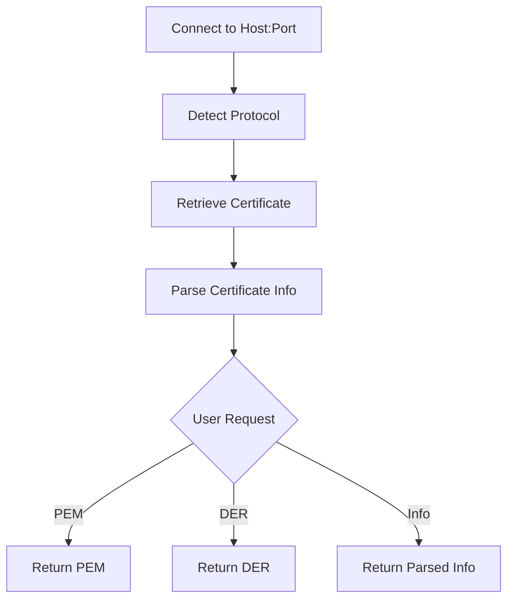

# Basic Usage

CertMonitor is built to make retrieving and validating a TLS certificate as painless as possible. Let's start with the smallest example that does something useful, then look at exactly what comes back.

## A minimal example

Here's the pattern you'll use most often. Connect to a host, pull the certificate details, and run the validators:

```python
from certmonitor import CertMonitor

with CertMonitor("example.com") as monitor:
    cert_data = monitor.get_cert_info()
    validation_results = monitor.validate()
    print(cert_data)
    print(validation_results)
```

Two calls do the work. `get_cert_info()` gives you the parsed certificate, and `validate()` runs the checks against it.

## How retrieval works

Behind that simple call, CertMonitor connects, figures out the protocol, fetches the certificate, and parses it. Depending on what you ask for, it hands back the certificate as PEM, as DER, or as already-parsed info:



## What `get_cert_info()` returns

Let's look at a real example. `get_cert_info()` returns a structured dictionary describing the certificate:

```json
{
  "subject": {
    "countryName": "US",
    "stateOrProvinceName": "California",
    "localityName": "Los Angeles",
    "organizationName": "Internet Corporation for Assigned Names and Numbers",
    "commonName": "www.example.com"
  },
  "issuer": {
    "countryName": "US",
    "organizationName": "DigiCert Inc",
    "commonName": "DigiCert Global G2 TLS RSA SHA256 2020 CA1"
  },
  "version": 3,
  "serialNumber": "075BCEF30689C8ADDF13E51AF4AFE187",
  "notBefore": "2024-01-30T00:00:00",
  "notAfter": "2025-03-01T23:59:59",
  "subjectAltName": {
    "DNS": [
      "www.example.com",
      "example.com"
    ],
    "IP Address": []
  },
  "OCSP": [
    "http://ocsp.digicert.com"
  ],
  "caIssuers": [
    "http://cacerts.digicert.com/DigiCertGlobalG2TLSRSASHA2562020CA1-1.crt"
  ],
  "crlDistributionPoints": [
    "http://crl3.digicert.com/DigiCertGlobalG2TLSRSASHA2562020CA1-1.crl",
    "http://crl4.digicert.com/DigiCertGlobalG2TLSRSASHA2562020CA1-1.crl"
  ]
}
```

As you can see, it's all there: who the certificate is for (`subject`), who issued it (`issuer`), how long it's valid (`notBefore` and `notAfter`), the alternate names it covers, and the revocation endpoints.

## What `validate()` returns

Now for the checks. `validate()` returns a dictionary keyed by validator name, with a structured result under each one:

```json
{
  "expiration": {
    "is_valid": true,
    "days_to_expiry": 120,
    "expires_on": "2025-03-01T23:59:59",
    "warnings": []
  },
  "subject_alt_names": {
    "is_valid": true,
    "sans": {"DNS": ["www.example.com", "example.com"], "IP Address": []},
    "count": 2,
    "contains_host": {"name": "www.example.com", "is_valid": true, "reason": "Matched DNS SAN"},
    "contains_alternate": {"example.com": {"name": "example.com", "is_valid": true, "reason": "Matched DNS SAN"}},
    "warnings": []
  }
}
```

Each validator reports its own `is_valid` flag plus the details behind its decision. That structure is consistent across every validator, so once you can read one result you can read them all.

!!! tip "Don't ignore the warnings list"
    `is_valid` tells you whether a check passed, but `warnings` can flag things that are technically valid yet still worth your attention. It's worth looking at both. The [Validators](../validators/index.md) section explains each result field in detail.

## More to explore

### Getting cipher info

The certificate isn't the only artifact worth inspecting. You can also ask for the negotiated cipher suite:

```python
with CertMonitor("example.com") as monitor:
    cipher_info = monitor.get_cipher_info()
    print(cipher_info)
```

Here's what that looks like:

```json
{
  "cipher_suite": {
    "name": "TLS_AES_256_GCM_SHA384",
    "encryption_algorithm": "AES-256-GCM",
    "message_authentication_code": "AEAD",
    "key_exchange_algorithm": "Not applicable (TLS 1.3 uses ephemeral key exchange by default)"
  },
  "protocol_version": "TLSv1.3",
  "key_bit_length": 256
}
```

This tells you which cipher suite was negotiated, which protocol version was used, and the key strength behind it.

!!! tip "Ready for more?"
    Head back to the [Usage Overview](index.md) for advanced examples, including custom validators, error handling, and retrieving raw PEM or DER output.
