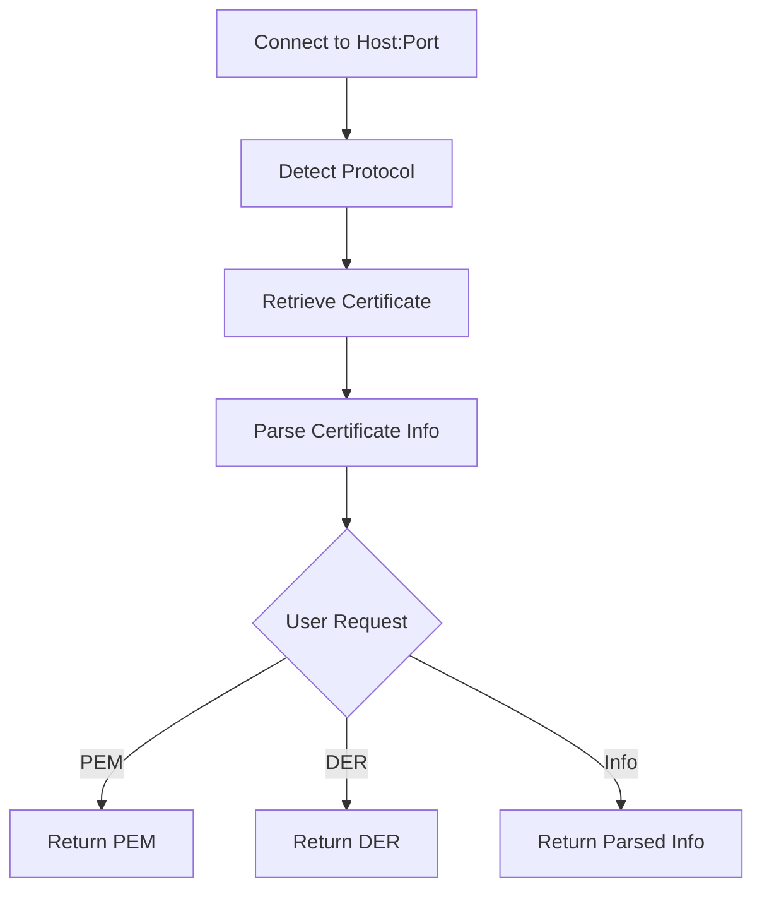

# Basic Usage

CertMonitor is built to make retrieving and validating a TLS certificate as painless as possible. Let's start with the smallest example that does something useful, then look at exactly what comes back.

## A minimal example

Here's the pattern you'll use most often. Connect to a host, pull the certificate details, and run the validators:

```python
from certmonitor import CertMonitor

with CertMonitor("example.com") as monitor:
    cert_data = monitor.get_cert_info()
    validation_results = monitor.validate()
    print(cert_data)
    print(validation_results)
```

`get_cert_info()` gives you the parsed certificate, and `validate()` runs the checks against it. If you only need the checks, call `validate()` directly; it collects the certificate for you.

## Run it

Save the example as `check_cert.py`, then run it with the Python environment where you installed CertMonitor:

```sh
python check_cert.py
```

You'll see two dictionaries: the certificate details, followed by the validator results. The certificate can change when the server renews it, so your output will not necessarily match the illustrations below.

## Walk through the code

1. **Create the monitor.** `CertMonitor("example.com")` sets the target and uses port 443. Entering the `with` block connects; leaving it closes the collection connection.
2. **Read the certificate.** `get_cert_info()` collects and parses a snapshot. You can inspect an expired or untrusted certificate because collection is permissive.
3. **Run the checks.** `validate()` runs `expiration`, `hostname`, and `root_certificate` by default. Trust uses a separate verified handshake; a successful retrieval alone is not a trust verdict.

If a host cannot be reached, the retrieval method returns an error dictionary. The enabled validators still get failed results explaining what was unavailable. [Error Handling](error_handling.md) shows how to turn those into useful logs or alerts.

## How retrieval works

Behind that simple call, CertMonitor connects, figures out the protocol, fetches the certificate, and parses it. Depending on what you ask for, it hands back the certificate as PEM, as DER, or as already-parsed info:


```mermaid
flowchart TD
    A[Connect to Host:Port] --> B[Detect Protocol]
    B --> C[Retrieve Certificate]
    C --> D[Parse Certificate Info]
    D --> E{User Request}
    E -->|PEM| F[Return PEM]
    E -->|DER| G[Return DER]
    E -->|Info| H[Return Parsed Info]
```

## What `get_cert_info()` returns

Let's look at the shape. `get_cert_info()` returns a structured dictionary describing the certificate. This illustrative snapshot uses historical dates; it is not a live result from `example.com`:

```json
{
  "subject": {
    "countryName": "US",
    "stateOrProvinceName": "California",
    "localityName": "Los Angeles",
    "organizationName": "Internet Corporation for Assigned Names and Numbers",
    "commonName": "www.example.com"
  },
  "issuer": {
    "countryName": "US",
    "organizationName": "DigiCert Inc",
    "commonName": "DigiCert Global G2 TLS RSA SHA256 2020 CA1"
  },
  "version": 3,
  "serialNumber": "075BCEF30689C8ADDF13E51AF4AFE187",
  "notBefore": "Jan 30 00:00:00 2024 GMT",
  "notAfter": "Mar  1 23:59:59 2025 GMT",
  "subjectAltName": {
    "DNS": [
      "www.example.com",
      "example.com"
    ],
    "IP Address": []
  },
  "OCSP": [
    "http://ocsp.digicert.com"
  ],
  "caIssuers": [
    "http://cacerts.digicert.com/DigiCertGlobalG2TLSRSASHA2562020CA1-1.crt"
  ],
  "crlDistributionPoints": [
    "http://crl3.digicert.com/DigiCertGlobalG2TLSRSASHA2562020CA1-1.crl",
    "http://crl4.digicert.com/DigiCertGlobalG2TLSRSASHA2562020CA1-1.crl"
  ]
}
```

As you can see, it's all there: who the certificate is for (`subject`), who issued it (`issuer`), how long it's valid (`notBefore` and `notAfter`), the alternate names it covers, and the revocation endpoints. The dates use the SSL date format shown above. Those endpoint URLs are metadata; CertMonitor does not fetch them to check revocation.

## What `validate()` returns

Now for the checks. `validate()` returns a dictionary keyed by validator name, with a structured result under each one:

This is the full result of a scan against example.com at the time of writing. Certificate details and dates depend on the endpoint.

```json
{
  "expiration": {
    "is_valid": true,
    "days_to_expiry": 51,
    "expires_on": "2026-10-27T22:17:21+00:00",
    "warnings": [],
    "lifetime_days": 90,
    "status": "pass",
    "code": "expiration.pass"
  },
  "hostname": {
    "is_valid": true,
    "alt_names": [
      "example.com",
      "*.example.com"
    ],
    "identity_source": "subjectAltName",
    "common_name": "example.com",
    "common_name_matches": true,
    "matched_name": "example.com",
    "status": "pass",
    "code": "hostname.pass"
  },
  "root_certificate": {
    "is_valid": true,
    "status": "pass",
    "trust_verified": true,
    "revocation_status": "not_checked",
    "warnings": [],
    "issuer": {
      "countryName": "US",
      "organizationName": "SSL Corporation",
      "commonName": "Cloudflare TLS Issuing ECC CA 3"
    },
    "code": "root_certificate.pass"
  }
}
```

Each validator reports its own `is_valid` flag plus the details behind its decision. That structure is consistent across every validator, so once you can read one result you can read them all.

!!! tip "Don't ignore the warnings list"
    `is_valid` tells you whether a check passed, but `warnings` can flag things that are technically valid yet still worth your attention. It's worth looking at both. The [Validators](../validators/index.md) section explains each result field in detail.

## More to explore

### Getting cipher info

The certificate isn't the only artifact worth inspecting. You can also ask for the negotiated cipher suite:

```python
with CertMonitor("example.com") as monitor:
    cipher_info = monitor.get_cipher_info()
    print(cipher_info)
```

Here's what that looks like:

```json
{
  "cipher_suite": {
    "name": "TLS_AES_256_GCM_SHA384",
    "encryption_algorithm": "AES",
    "message_authentication_code": "SHA384",
    "key_exchange_algorithm": "Not applicable (TLS 1.3 uses ephemeral key exchange by default)"
  },
  "protocol_version": "TLSv1.3",
  "key_bit_length": 256
}
```

This tells you which cipher suite was negotiated, which protocol version was used, and the key strength behind it.

### Getting the raw certificate

Sometimes you want the certificate itself, not the parsed view, so you can hand it to another tool or store it. CertMonitor gives you both standard encodings.

PEM is the base64 text form (the `-----BEGIN CERTIFICATE-----` block you've probably seen):

```python
with CertMonitor("example.com") as monitor:
    pem_cert = monitor.get_raw_pem()
    print(pem_cert)
```

```text
-----BEGIN CERTIFICATE-----
MIIDdzCCAl+gAwIBAgIEAgAAuQ...(truncated for brevity)...IDAQAB
-----END CERTIFICATE-----
```

DER is the raw binary form, returned as `bytes`:

```python
with CertMonitor("example.com") as monitor:
    der_cert = monitor.get_raw_der()
    if isinstance(der_cert, bytes):
        print(der_cert[:20])
    else:
        print(der_cert["error"], der_cert["message"])
```

```text
b'0\x82\x03w0\x82\x02_\xa0\x03\x02\x01\x02\x02\x04\x02\x00\x00\xb9'
```

!!! tip "Which one do I want?"
    Reach for PEM for most file-based work, human inspection, and tools that expect text. Reach for DER when you need the exact bytes (hashing, fingerprinting, passing to a binary API). The [Retrieving Raw Certificate Data](raw_cert.md) page goes deeper, including converting between the two.

!!! tip "Ready for more?"
    Head back to the [Usage Overview](index.md) for advanced examples, including custom validators, error handling, and retrieving raw PEM or DER output.
