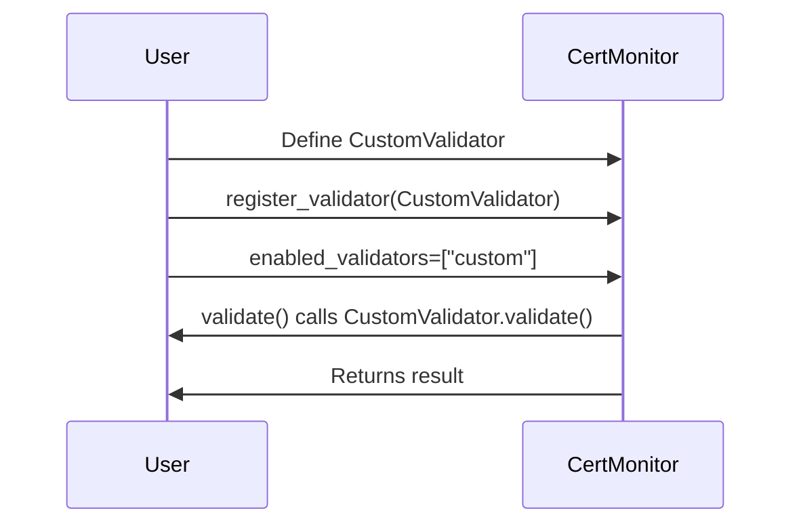

# Custom Validators

CertMonitor is designed to be extensible. You can add your own validators to check for custom certificate or connection properties that are important to your environment or compliance needs.

## Why Use a Custom Validator?

Some use cases for custom validators include:

- Enforcing organization-specific policies (e.g., only allow certain CAs or key types)
- Checking for custom certificate extensions or metadata
- Integrating with external compliance or inventory systems
- Alerting on deprecated cryptographic algorithms

## How to Create a Custom Validator

1. **Subclass the base validator** (`BaseCertValidator` for certificate-based, `BaseCipherValidator` for cipher-based).
2. **Implement the `validate` method** with your custom logic. User-configurable arguments must be declared as **keyword-only** parameters (after `*`), each with a type annotation and a default — this is enforced at import time.
3. **Return a result that follows the [result contract](../validators/index.md#the-result-contract)**: `is_valid` is always a strict bool, and `reason` is present exactly when `is_valid` is `False`.
4. **Register your validator** with `register_validator()`.

### Example: Enforce a Minimum Key Size

Suppose you want to ensure all certificates use at least a 3072-bit RSA key.

```python
from typing import Any, Dict, Optional

from certmonitor.validators.base import BaseCertValidator
from certmonitor.validators.results import ValidationResult


class MinKeySizeResult(ValidationResult, total=False):
    """Declares the result shape so mypy checks it (optional but recommended)."""

    key_size: Optional[int]
    min_size: int


class MinKeySizeValidator(BaseCertValidator):
    name = "min_key_size"

    def validate(
        self, cert: Dict[str, Any], host: str, port: int, *, min_size: int = 3072
    ) -> MinKeySizeResult:
        key_size = cert.get("public_key_info", {}).get("size")
        is_valid = key_size is not None and key_size >= min_size
        result: MinKeySizeResult = {
            "is_valid": is_valid,
            "key_size": key_size,
            "min_size": min_size,
        }
        if not is_valid:
            result["reason"] = (
                f"Key size {key_size} is too small (minimum required: {min_size})"
            )
        return result
```

### Register and Use Your Validator

Register your validator using `register_validator()` (recommended), then enable it by passing its name in `enabled_validators` to `CertMonitor`.

```python
from certmonitor import CertMonitor
from certmonitor.validators import register_validator

# Register your custom validator (recommended)
register_validator(MinKeySizeValidator())

# Enable your validator by name and pass arguments if needed
with CertMonitor("example.com", enabled_validators=["min_key_size"]) as monitor:
    # Arguments are passed as a dict of keyword arguments per validator
    results = monitor.validate({"min_key_size": {"min_size": 4096}})
    print(results["min_key_size"])
```

#### Example Output

```json
{
  "is_valid": false,
  "key_size": 2048,
  "min_size": 4096,
  "reason": "Key size 2048 is too small (minimum required: 4096)"
}
```

## Custom Validator Registration & Usage (Mermaid Diagram)



---

> **Tip:** Custom validators can accept arguments via the `validate()` call, just like built-in validators. See [Passing Arguments to Validators](validator_args.md) for details.

For more advanced integration, see the [API Reference](../reference/validators.md) for the validator base class and registration details.
