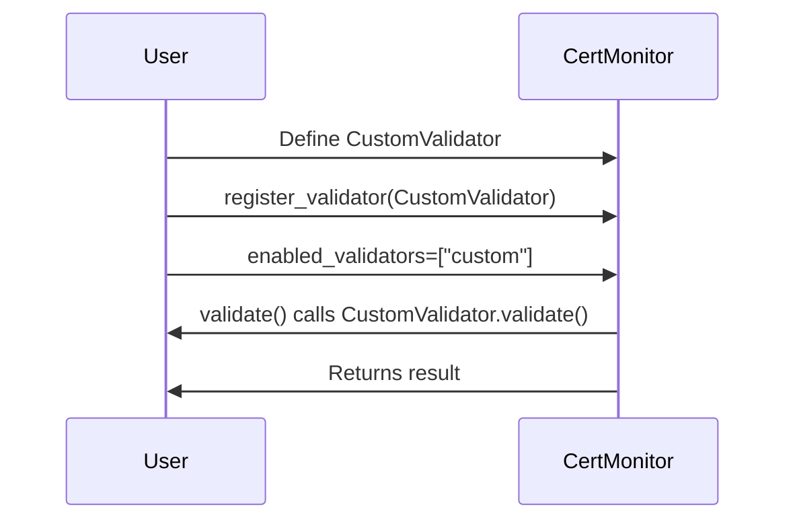

# Custom Validators

CertMonitor ships with a solid set of validators, but it can't know every rule your organization cares about. So it's built to be extended. When you need a check that doesn't exist yet, you write your own validator and register it, and from then on it behaves just like a built-in one.

## Why write a custom validator?

A few cases where this pays off:

- Enforcing organization-specific policies, like allowing only certain CAs or key types
- Checking for custom certificate extensions or metadata
- Integrating with external compliance or inventory systems
- Alerting on deprecated cryptographic algorithms

## How it works

There are four steps, and none of them are complicated:

1. **Subclass the right base.** Use `BaseCertValidator` for certificate-based checks, or `BaseCipherValidator` for cipher-based ones.
2. **Implement `validate`.** This is where your logic lives. Any user-configurable arguments must be **keyword-only** parameters (after the `*`), each with a type annotation and a default. CertMonitor enforces this at import time.
3. **Return a result that follows the [result contract](../validators/index.md#the-result-contract).** Always include `is_valid` as a strict bool, and include `reason` only when `is_valid` is `False`.
4. **Register it** with `register_validator()`.

!!! warning "The key is `is_valid`, not `success`"
    Every validator result has to use `is_valid` for the pass/fail flag. CertMonitor relies on that exact key, so a result built around `success` or any other name won't be understood.

## Example: enforce a minimum key size

Let's build something concrete. Suppose your policy says every certificate must use at least a 3072-bit RSA key. Here's a validator that checks exactly that:

```python
from typing import Any, Dict, Optional

from certmonitor.validators.base import BaseCertValidator
from certmonitor.validators.results import ValidationResult


class MinKeySizeResult(ValidationResult, total=False):
    """Declares the result shape so mypy checks it (optional but recommended)."""

    key_size: Optional[int]
    min_size: int


class MinKeySizeValidator(BaseCertValidator):
    name = "min_key_size"

    def validate(
        self, cert: Dict[str, Any], host: str, port: int, *, min_size: int = 3072
    ) -> MinKeySizeResult:
        key_size = cert.get("public_key_info", {}).get("size")
        is_valid = key_size is not None and key_size >= min_size
        result: MinKeySizeResult = {
            "is_valid": is_valid,
            "key_size": key_size,
            "min_size": min_size,
        }
        if not is_valid:
            result["reason"] = (
                f"Key size {key_size} is too small (minimum required: {min_size})"
            )
        return result
```

Notice the pattern. `min_size` is keyword-only (it sits after the `*`), annotated, and has a default. And `reason` is only added when the check fails, which is exactly what the result contract asks for.

!!! tip "The `ValidationResult` subclass is optional"
    Declaring `MinKeySizeResult` lets mypy verify your result shape, which is nice to have but not required. A plain dict works just as well at runtime.

## Register and use your validator

Register the validator with `register_validator()`, then turn it on by passing its name in `enabled_validators` when you create the `CertMonitor`:

```python
from certmonitor import CertMonitor
from certmonitor.validators import register_validator

# Register your custom validator (recommended)
register_validator(MinKeySizeValidator())

# Enable your validator by name and pass arguments if needed
with CertMonitor("example.com", enabled_validators=["min_key_size"]) as monitor:
    # Arguments are passed as a dict of keyword arguments per validator
    results = monitor.validate({"min_key_size": {"min_size": 4096}})
    print(results["min_key_size"])
```

!!! note "Custom validators are opt-in"
    Only `expiration`, `hostname`, and `root_certificate` run by default. Everything else, including your own validators, has to be named in `enabled_validators` before it runs.

### Example output

Here, the host's 2048-bit key falls short of the 4096-bit minimum we asked for, so the check fails and a `reason` comes along to explain why:

```json
{
  "is_valid": false,
  "key_size": 2048,
  "min_size": 4096,
  "reason": "Key size 2048 is too small (minimum required: 4096)"
}
```

## The full lifecycle

Putting it all together, here's the round trip from defining a validator to getting a result back:



!!! tip "Custom validators take arguments too"
    Just like the built-ins, your validator can accept arguments through the `validate()` call. See [Passing Arguments to Validators](validator_args.md) for the details.

For deeper integration, the [API Reference](../reference/validators.md) covers the validator base class and registration in full.
