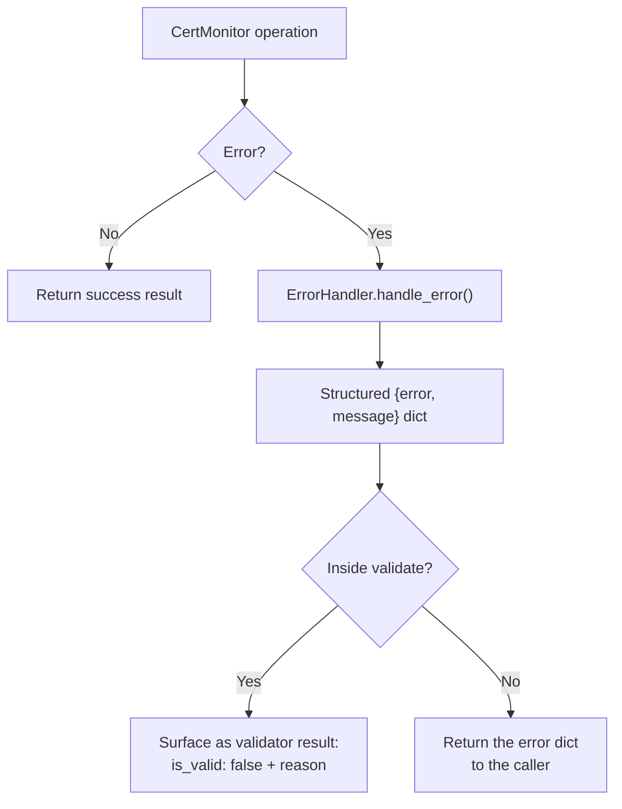

# Error Handling

CertMonitor never raises for the ordinary failures of talking to remote hosts — unreachable servers, protocol mismatches, missing data. Instead it **returns structured error dicts**, so a monitoring loop can keep going and log what happened rather than crashing.

## Errors from `CertMonitor` methods

Methods like `get_cert_info()`, `get_raw_der()`, and `get_cipher_info()` return a dict with an `error` (machine-readable class) and `message` (human-readable detail) when something goes wrong:

```python
from certmonitor import CertMonitor

with CertMonitor("badhost.invalid") as monitor:
    cert = monitor.get_cert_info()
    if isinstance(cert, dict) and "error" in cert:
        print(cert["error"], "-", cert["message"])
        # e.g. "ConnectionError - [Errno 8] nodename nor servname provided..."
```

Common error classes: `ConnectionError`, `ProtocolDetectionError`, `ProtocolError`, `CertificateError`, `CipherError`.

## Errors from validators

Validators follow the same philosophy through the [result envelope](../validators/index.md#the-result-contract): an operational failure is still a **result**, never a missing key. If a validator's data source can't be fetched, it appears in `validate()` output with `is_valid: false` and a `reason` (plus `error`/`message` where a machine-readable class helps):

```python
results = monitor.validate()
# Safe to index every enabled validator — none are silently dropped:
expiry = results["expiration"]
if not expiry["is_valid"]:
    alert(expiry["reason"])
```

This means a pipeline can rely on `results["<name>"]` existing for every enabled validator and never special-case a `KeyError`.

## How it flows



!!! tip "Detecting an error dict"
    A successful certificate/cipher call returns its normal structure; a failure returns a dict containing `"error"`. The reliable check is `isinstance(result, dict) and "error" in result`. For validators, just check `result["is_valid"]` and read `result["reason"]`.
