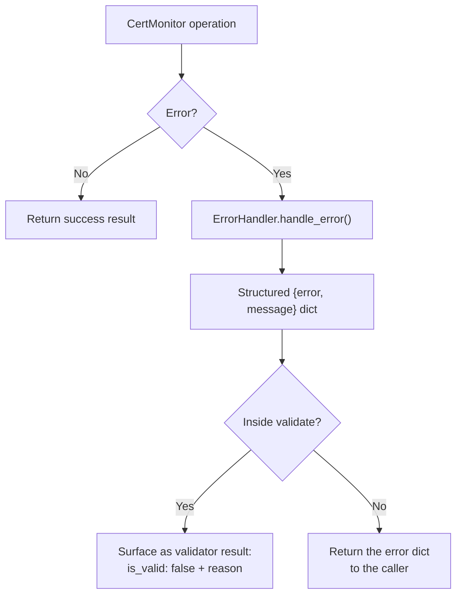

# Error Handling

Unreachable servers, protocol mismatches, and missing data are ordinary parts of monitoring. CertMonitor returns **structured error dictionaries** for these failures, so your loop can log what happened and move on to the next host.

## Errors from `CertMonitor` methods

Methods like `get_cert_info()`, `get_raw_der()`, and `get_cipher_info()` return a dict with an `error` (machine-readable class) and `message` (human-readable detail) when something goes wrong:

```python
from certmonitor import CertMonitor

with CertMonitor("badhost.invalid") as monitor:
    cert = monitor.get_cert_info()
    if isinstance(cert, dict) and "error" in cert:
        print(cert["error"], "-", cert["message"])
        # e.g. "ConnectionError - [Errno 8] nodename nor servname provided..."
```

Common error classes: `ConnectionError`, `ProtocolDetectionError`, `ProtocolError`, `CertificateError`, `CipherError`.

## Errors from validators

Validators follow the same philosophy through the [result envelope](../validators/index.md#the-result-contract): an operational failure is still a **result**, never a missing key. If a validator's data source can't be fetched, it appears in `validate()` output with `is_valid: false` and a `reason` (plus `error`/`message` where a machine-readable class helps):

```python
with CertMonitor("badhost.invalid") as monitor:
    results = monitor.validate()
# Safe to index every enabled validator; none are silently dropped:
expiry = results["expiration"]
if not expiry["is_valid"]:
    print(expiry["reason"])
```

This means a pipeline can rely on `results["<name>"]` existing for every enabled validator and never special-case a `KeyError`.

## How it flows


```mermaid
flowchart TD
    A[CertMonitor operation] --> B{Error?}
    B -- No --> C[Return success result]
    B -- Yes --> D["ErrorHandler.handle_error()"]
    D --> E["Structured {error, message} dict"]
    E --> F{Inside validate?}
    F -- Yes --> G["Surface as validator result:<br/>is_valid: false + reason"]
    F -- No --> H["Return the error dict<br/>to the caller"]
```

!!! tip "Detecting an error dict"
    A successful certificate/cipher call returns its normal structure; a failure returns a dict containing `"error"`. The reliable check is `isinstance(result, dict) and "error" in result`. For validators, just check `result["is_valid"]` and read `result["reason"]`.

## Separate a failed check from a failed scan

`is_valid` is false in both cases, but `status` tells you what happened:

| Status | What to do with it |
|---|---|
| `pass` | The configured check passed. |
| `warn` | The check passed and reported warnings; review them for renewal or policy planning. |
| `fail` | The available evidence failed the check. Read `reason`. |
| `error` | An operational or invocation failure prevented the check. Log `error` and `message` when present. |
| `unsupported` | The check could not apply to the supplied data or request. |

These fields are added by `CertMonitor.validate()`. Direct calls to a validator can return its underlying fields without dispatcher metadata.

Configuration and programming mistakes can still raise exceptions. For example, a nonpositive constructor `timeout` raises `ValueError`, and a malformed custom validator signature raises `TypeError` when the class is defined. Structured network errors do not replace normal Python exception handling for your own code.
