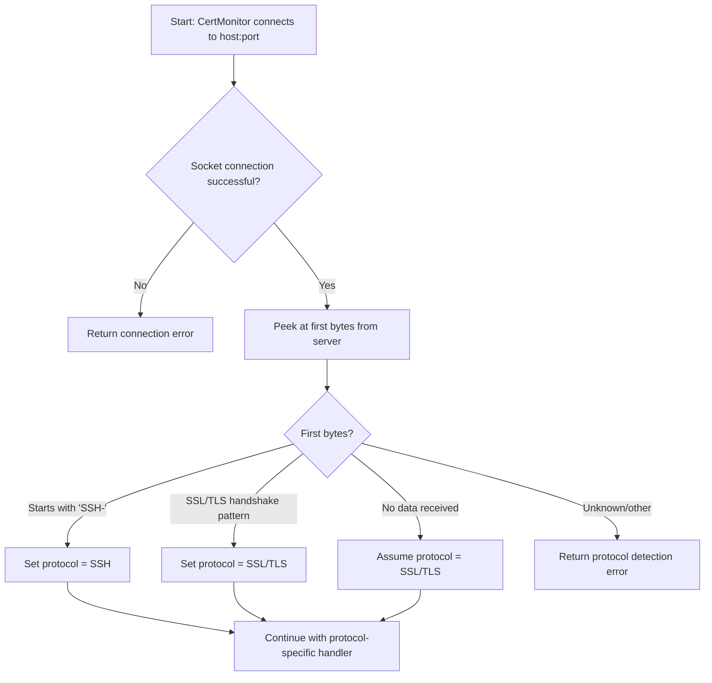
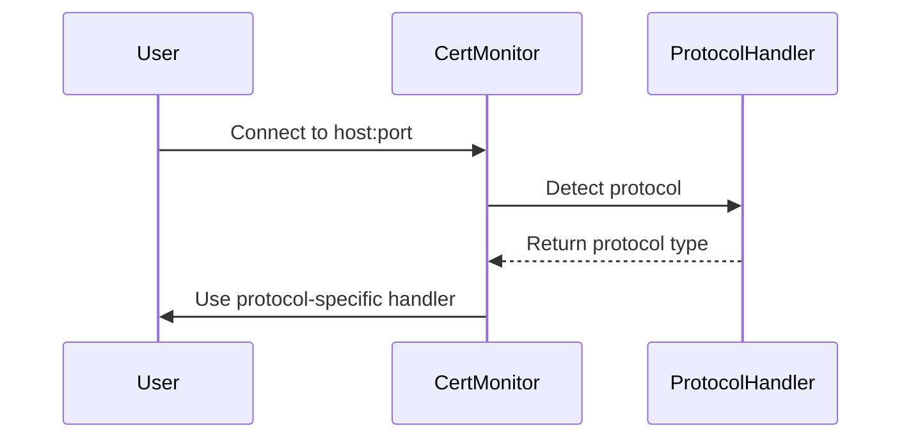

# Protocol Detection

You don't have to tell CertMonitor what kind of endpoint you're connecting to. It figures that out for you by detecting the protocol used by the target host and port. The payoff is a single, consistent API that works for SSL/TLS today, and (in the future) SSH endpoints too.

## How Protocol Detection Works

When you create a `CertMonitor` instance and connect to a host, here's what happens behind the scenes:

1. CertMonitor attempts to open a socket connection to the host and port.
2. It peeks at the first few bytes sent by the server:
    - If the bytes start with `SSH-`, the protocol is detected as SSH.
    - If the bytes match common SSL/TLS handshake patterns, the protocol is detected as SSL/TLS.
    - If no data is received, CertMonitor assumes SSL/TLS by default (since many servers wait for a handshake).
3. If the protocol cannot be determined, CertMonitor returns a structured error.

!!! note "Why peek at the bytes?"
    Different protocols announce themselves differently the moment a connection opens. SSH servers send a banner that starts with `SSH-`, while TLS servers expect the client to begin the handshake. Reading those first bytes lets CertMonitor route you to the right handler without you having to configure anything.

## Protocol Detection Flow

The diagram below traces the decision CertMonitor makes when it connects:



## Protocol Handler Selection

Once the protocol is known, CertMonitor hands off to the matching handler:



## Example

Let's connect to two different kinds of endpoints and ask CertMonitor what it found. The detected protocol is always available on `monitor.protocol`:

```python
from certmonitor import CertMonitor

with CertMonitor("example.com", port=443) as monitor:
    print(monitor.protocol)  # 'ssl'

with CertMonitor("my-ssh-server.example.com", port=22) as monitor:
    print(monitor.protocol)  # 'ssh' (if supported)
```

Notice that you used the same API both times. CertMonitor sorted out the protocol on its own.

## Current Support and Roadmap

- **SSL/TLS**: Full support for certificate retrieval, validation, and cipher info.
- **SSH**: Protocol detection is implemented, but robust SSH certificate/key validation is coming soon. Future versions will allow you to:
    - Retrieve SSH host keys
    - Validate SSH key types, fingerprints, and algorithms
    - Integrate with SSH CA and trust models

!!! warning "SSL/TLS features on an SSH endpoint"
    Some features (like raw DER/PEM and cipher info) are specific to SSL/TLS. If you call one of them against an SSH endpoint, CertMonitor returns a clear error message rather than failing silently.

!!! tip "Check the protocol yourself"
    You can always read the detected protocol via `monitor.protocol` and branch on it in your own code if you need to handle different protocols differently.
