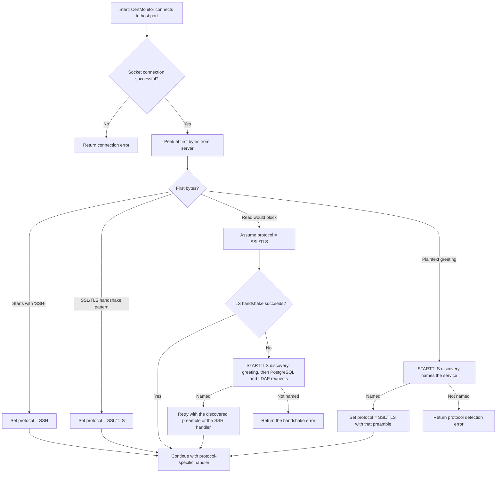
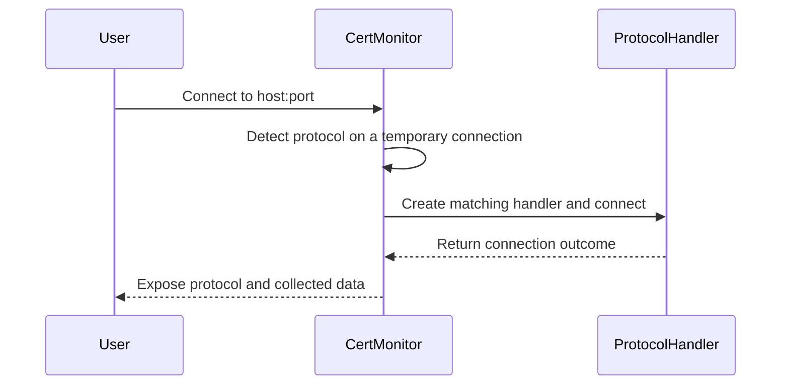

# Protocol Detection

You don't have to tell CertMonitor what kind of endpoint you're connecting to. It figures that out for you by detecting the protocol used by the target host and port, including services that greet in plaintext and upgrade with STARTTLS. Most of the API is built for SSL/TLS. SSH support is currently limited to reading a version banner; it does not validate SSH host keys.

!!! note "Forcing a STARTTLS protocol"
    Pass `starttls="smtp"` (or another supported protocol) when you already know the service. Detection and discovery are skipped and that preamble runs before every handshake; see [STARTTLS Services](starttls.md).

## How Protocol Detection Works

When you create a `CertMonitor` instance and connect to a host, here's what happens behind the scenes:

1. CertMonitor attempts to open a socket connection to the host and port.
2. It peeks at the first few bytes sent by the server:
    - If the bytes start with `SSH-`, the protocol is detected as SSH.
    - If the bytes match common SSL/TLS handshake patterns, the protocol is detected as SSL/TLS.
    - If a nonblocking read would have to wait, CertMonitor assumes SSL/TLS (since TLS servers wait for the client to start).
    - Anything else is a plaintext greeting, so CertMonitor asks STARTTLS discovery to name the service: IMAP, POP3, SSH, or the `220` shared by SMTP and FTP.
3. If a TLS handshake then fails on a port that looked silent, CertMonitor runs the same discovery before giving up. A greeting that had not arrived yet is read now, and a silent service is asked the PostgreSQL and LDAP StartTLS requests in turn. Discovery never looks at the port number and is bounded by `timeout`.
4. If the service still cannot be named, CertMonitor returns the structured error from the handshake.

!!! note "Why peek at the bytes?"
    Different protocols announce themselves differently the moment a connection opens. SSH servers send a banner that starts with `SSH-`, mail and directory servers send a plaintext greeting, and TLS servers expect the client to begin the handshake. Reading those first bytes lets CertMonitor route you to the right handler without you having to configure anything.

!!! note "Why discover after the handshake fails, not before?"
    Waiting for a greeting on every port would slow down every HTTPS check, and most ports are HTTPS. A TLS server answers a ClientHello straight away, so trying the handshake first costs nothing when it works. Only a port that refuses it pays for discovery, and that port was going to fail anyway.

## Protocol Detection Flow

The diagram below traces the decision CertMonitor makes when it connects:


```mermaid
flowchart TD
    A[Start: CertMonitor connects to host:port] --> B{Socket connection successful?}
    B -- No --> E[Return connection error]
    B -- Yes --> C[Peek at first bytes from server]
    C --> D{First bytes?}
    D -- Starts with 'SSH-' --> F[Set protocol = SSH]
    D -- SSL/TLS handshake pattern --> G[Set protocol = SSL/TLS]
    D -- Read would block --> H[Assume protocol = SSL/TLS]
    D -- Plaintext greeting --> K[STARTTLS discovery names the service]
    K -- Named --> L[Set protocol = SSL/TLS with that preamble]
    K -- Not named --> I[Return protocol detection error]
    H --> M{TLS handshake succeeds?}
    M -- Yes --> J[Continue with protocol-specific handler]
    M -- No --> N[STARTTLS discovery: greeting, then PostgreSQL and LDAP requests]
    N -- Named --> O[Retry with the discovered preamble or the SSH handler]
    N -- Not named --> P[Return the handshake error]
    F & G & L & O --> J
```

## Protocol Handler Selection

Once the protocol is known, CertMonitor hands off to the matching handler:


```mermaid
sequenceDiagram
    participant User
    participant CertMonitor
    participant ProtocolHandler
    User->>CertMonitor: Connect to host:port
    CertMonitor->>CertMonitor: Detect protocol on a temporary connection
    CertMonitor->>ProtocolHandler: Create matching handler and connect
    ProtocolHandler-->>CertMonitor: Return connection outcome
    CertMonitor-->>User: Expose protocol and collected data
```

## Example

Let's connect to two different kinds of endpoints and ask CertMonitor what it found. After a successful connection, the detected protocol is available on `monitor.protocol`. Replace the SSH placeholder with a server you operate:

```python
from certmonitor import CertMonitor

with CertMonitor("example.com", port=443) as monitor:
    print(monitor.protocol)  # 'ssl'

with CertMonitor("my-ssh-server.example.com", port=22) as monitor:
    print(monitor.protocol)  # 'ssh' if detection succeeds
```

A delayed SSH banner looks like a silent TLS server at first. The failed handshake then triggers discovery, which reads the banner and switches to the SSH handler, so the delay costs one extra connection rather than a wrong answer. If detection still fails, inspect the structured connection error; don't treat the guessed protocol as proof.

## Current Support and Roadmap

- **SSL/TLS**: Full support for certificate retrieval, validation, and cipher info.
- **SSH**: Detection and version-banner retrieval only. SSH host-key retrieval, fingerprints, key validation, and SSH CA trust are not implemented.

!!! warning "SSL/TLS features on an SSH endpoint"
    Some features (like raw DER/PEM and cipher info) are specific to SSL/TLS. If you call one of them against an SSH endpoint, CertMonitor returns a clear error message rather than failing silently.

!!! tip "Check the protocol yourself"
    You can always read the detected protocol via `monitor.protocol` and branch on it in your own code if you need to handle different protocols differently.
