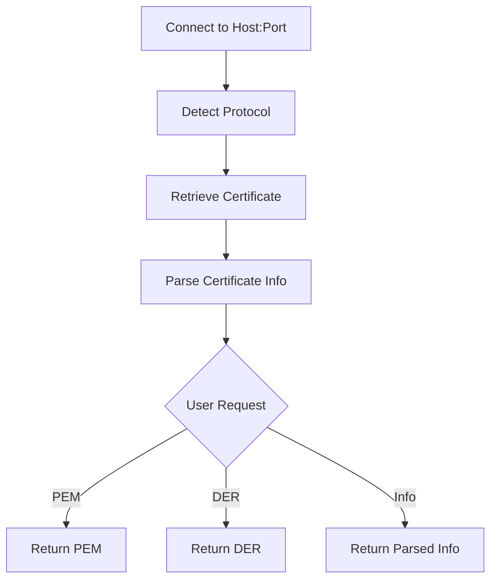

# Retrieving Raw Certificate Data

Sometimes you don't want CertMonitor's parsed view of a certificate. You want the certificate itself, in its original encoding, so you can hand it to another tool. CertMonitor lets you pull the raw certificate in two formats: PEM and DER.

## Get PEM format

PEM is the base64-encoded, human-readable format you've probably seen in `.pem` and `.crt` files. It's what most file-based tools expect.

Let's grab it:

```python
from certmonitor import CertMonitor

with CertMonitor("example.com") as monitor:
    pem = monitor.get_raw_pem()
    print(pem)
```

### Example output

```pem
-----BEGIN CERTIFICATE-----
MIIDdzCCAl+gAwIBAgIEAgAAuQ...(truncated for brevity)...IDAQAB
-----END CERTIFICATE-----
```

## Get DER format

DER is a binary format. It's what you reach for when a low-level API or cryptographic library wants raw bytes rather than text.

```python
with CertMonitor("example.com") as monitor:
    der = monitor.get_raw_der()
    print(der)  # This will print bytes; you may want to base64-encode for display
```

### Example output (base64-encoded for readability)

```text
MIIDdzCCAl+gAwIBAgIEAgAAuQ...(truncated for brevity)...IDAQAB
```

!!! note "DER is bytes, not text"
    `get_raw_der()` returns raw bytes. Printing them directly is noisy, so base64-encode the value first when you need something readable.

## How retrieval fits together

Here's the path a certificate takes, from the connection to whichever format you ask for:



As you can see, the same retrieved certificate can come back as PEM, as DER, or as parsed info. You pick the shape that fits your task.

## When to use each format

So which one do you want? It comes down to what's on the receiving end:

- **PEM**: Use it for most file-based operations, OpenSSL, and human inspection.
- **DER**: Use it for binary APIs, cryptographic libraries, or anywhere a raw byte array is required.

!!! tip "You can always convert"
    If you have one format and need the other, OpenSSL or Python's cryptography library will convert between PEM and DER for you.
