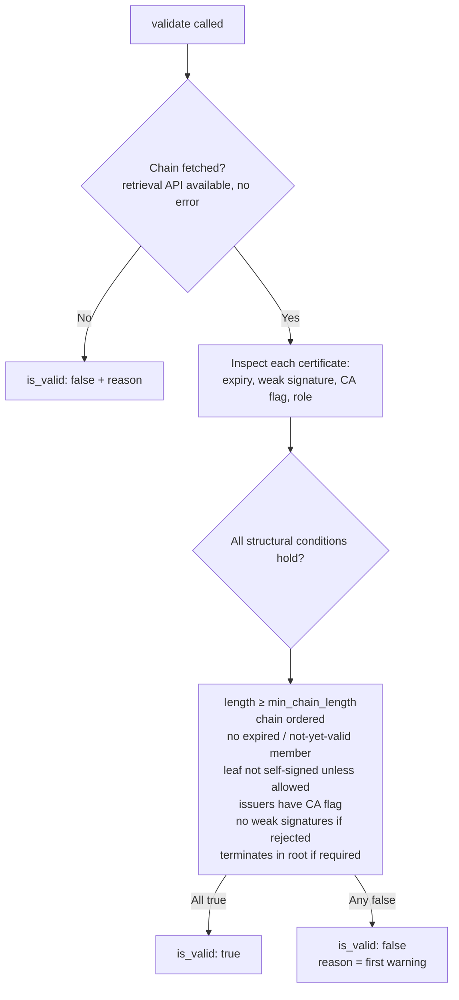

# Chain Validator

The `chain` validator inspects the **full certificate chain** the server presented during the TLS handshake and reports structural problems: missing intermediates, out-of-order chains, expired members, weak signature algorithms, and non-CA intermediates. It inspects the presented structure. Cryptographic signature and trust-path verification are handled separately by [RootCertificate](root_certificate.md).

## Opting in

The chain validator is **registered but disabled by default** because chain analysis is an additional policy check. Enable it by naming it explicitly:

```python
from certmonitor import CertMonitor

with CertMonitor(
    "example.com",
    enabled_validators=["expiration", "hostname", "root_certificate", "chain"],
) as monitor:
    monitor.get_cert_info()
    result = monitor.validate()
    print(result["chain"])
```

Or via the environment:

```sh
export ENABLED_VALIDATORS=expiration,hostname,root_certificate,chain
```

## User-configurable arguments

Pass via `validator_args={"chain": {...}}`. Each argument, its type, and its default are documented in the [reference](#reference) below, straight from the validator's docstring.

The default weak-signature set includes `sha1WithRSAEncryption`, `md5WithRSAEncryption`, `md2WithRSAEncryption`, `ecdsa-with-SHA1`, and `dsa-with-sha1`.

## How it decides

The chain is fetched, each certificate is inspected, and `is_valid` is the AND of every structural condition. Per-certificate warnings are collected regardless; on failure the first warning becomes the top-level `reason`.



## Output

Illustrative historical scan, abbreviated to show only the leaf entry in `certs`. A complete result has one entry per certificate (three in this example).

These examples show selected fields from illustrative scans. `validate()` also adds `status` and `code`, described in the [result contract](index.md#the-result-contract).

```json
{
  "is_valid": true,
  "structural_valid": true,
  "trust_verified": false,
  "chain_length": 3,
  "chain_ordered": true,
  "terminates_in_self_signed": true,
  "certs": [
    {
      "position": 0,
      "role": "leaf",
      "subject": {"commonName": "example.com"},
      "issuer": {"commonName": "Intermediate CA"},
      "not_before": "2025-01-01T00:00:00+00:00",
      "not_after": "2026-01-01T00:00:00+00:00",
      "days_to_expiry": 180,
      "is_ca": false,
      "is_self_signed": false,
      "signature_algorithm_oid": "1.2.840.113549.1.1.11",
      "subject_key_identifier": "ac33ac35b5f88ae27b06d23dc7058997d81c2443",
      "authority_key_identifier": "de1b1eed7915d43e3724c321bbec34396d42b230",
      "public_key_info": {"algorithm": "ecPublicKey", "size": 256, "curve": "secp256r1"},
      "warnings": []
    }
  ],
  "warnings": []
}
```

On failure, `is_valid` is `false` and a `reason` field is added.

## How the chain is retrieved

Chain retrieval uses the available socket chain API, with private `_sslobj` fallbacks on older interpreters. Private APIs are implementation details and may be unavailable; retrieval failures produce structured errors. Even a method named `get_verified_chain()` does not establish trust on CertMonitor's permissive collection socket.

The result includes `structural_valid` and `trust_verified: false`. Non-CA
issuers fail. Weak signatures also fail by default; set
`reject_weak_signatures=False` to retain warnings without rejection.
Issuer/subject equality, including the `is_self_signed` label, does not
verify a signature.

## What is out of scope

- **Cryptographic signature verification.** Structural validation (`subject(parent) == issuer(child)` plus SKI/AKI matching) catches the real-world misconfigurations this validator is built for. Cryptographic trust verification runs separately in [RootCertificate](root_certificate.md), using OpenSSL.
- **OCSP / CRL revocation checks.** Same reasoning: network I/O and responder parsing belong in their own validator.
- **Building a path against the system trust store.** Collection intentionally uses `ssl.CERT_NONE` so it can profile misconfigured and legacy servers. The separate root-certificate check uses the system or configured CA store.


!!! note "A presented chain is not a built trust path"
    Servers normally omit the root. CertMonitor does not fetch missing intermediates from AIA URLs. The minimum-length rule is your structural policy: a single leaf can be sufficient for a certificate signed directly by a trusted root, even though it fails the default length of two.

## Reference

::: certmonitor.validators.chain.ChainValidator
