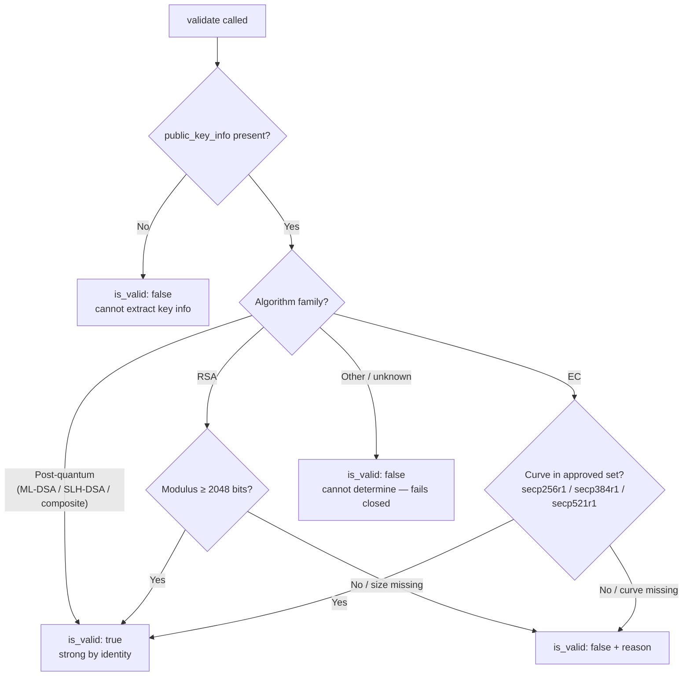

# KeyInfo Validator

The `key_info` validator judges the strength of the certificate's public key, per algorithm family:

- **RSA** — modulus must be at least 2048 bits.
- **EC** — curve must be one of `secp256r1`, `secp384r1`, `secp521r1`.
- **Post-quantum** (ML-DSA, SLH-DSA, composite ML-DSA) — strong by algorithm identity; the FIPS 204/205 parameter sets have no weak sizes or curves. The recognized set comes from the Rust registry via `certinfo.pq_algorithms()`.

Per the result envelope, `is_valid` is always a strict `bool`. When strength **cannot be determined** (an unrecognized algorithm, or a missing size/curve) the key **fails closed** — `is_valid: false` with a `reason` that distinguishes "cannot determine" from "recognized but weak".

## How it decides

## API

::: certmonitor.validators.key_info.KeyInfoValidator
