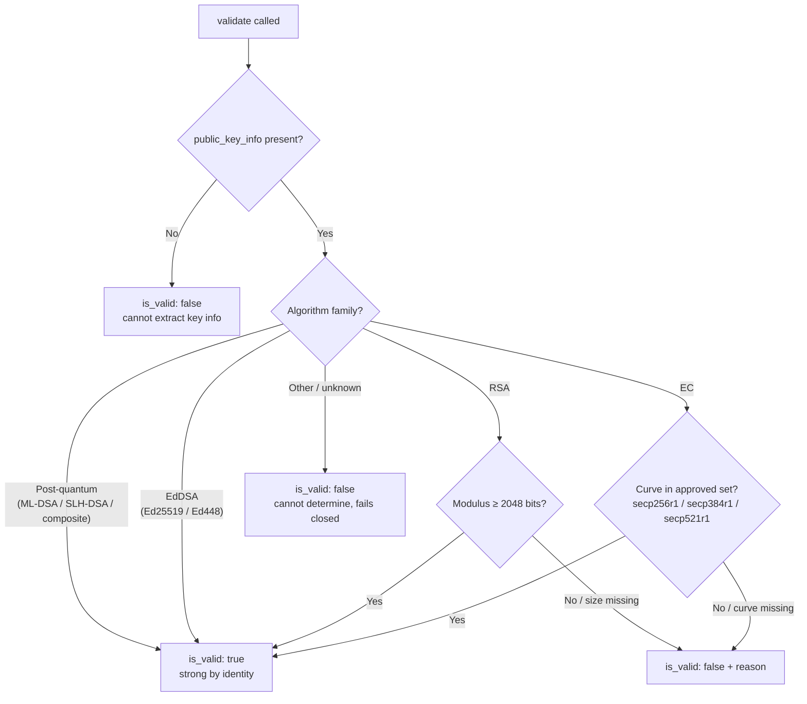

# KeyInfo Validator

The `key_info` validator judges the strength of the certificate's public key, per algorithm family:

- **RSA** (`rsaEncryption`, and `rsassaPss` for a key encoded with `id-RSASSA-PSS` per [RFC 4055 section 1.2](https://www.rfc-editor.org/rfc/rfc4055.html#section-1.2)): modulus must be at least 2048 bits.
- **EC**: curve must be one of `secp256r1`, `secp384r1`, `secp521r1`.
- **Post-quantum** (ML-DSA, SLH-DSA, composite ML-DSA): strong by algorithm identity; the FIPS 204/205 parameter sets have no weak sizes or curves. The recognized set comes from the Rust registry via `certinfo.pq_algorithms()`.
- **EdDSA** (Ed25519, Ed448): always strong; the algorithm fixes the parameters, so there is no size or curve to check.

Per the result envelope, `is_valid` is always a strict `bool`. When strength **cannot be determined** (an unrecognized algorithm, or a missing size/curve) the key **fails closed**: `is_valid: false` with a `reason` that distinguishes "cannot determine" from "recognized but weak".

## Try it

```python
from certmonitor import CertMonitor

with CertMonitor("example.com", enabled_validators=["key_info"]) as monitor:
    print(monitor.validate()["key_info"])
```

Look at `key_type` first, then `key_size` and `curve`. A 256-bit EC key and a 256-bit RSA modulus do not mean the same thing; this validator applies a separate rule to each family. PQ recognition is an algorithm classification, not a cryptographic proof of key or signature correctness.

## How it decides


```mermaid
flowchart TD
    A[validate called] --> B{public_key_info present?}
    B -- No --> Z["is_valid: false<br/>cannot extract key info"]
    B -- Yes --> C{Algorithm family?}
    C -- "Post-quantum<br/>(ML-DSA / SLH-DSA / composite)" --> D["is_valid: true<br/>strong by identity"]
    C -- "EdDSA<br/>(Ed25519 / Ed448)" --> D
    C -- RSA --> E{Modulus &ge; 2048 bits?}
    E -- Yes --> D
    E -- "No / size missing" --> F["is_valid: false + reason"]
    C -- EC --> H{Curve in approved set?<br/>secp256r1 / secp384r1 / secp521r1}
    H -- Yes --> D
    H -- "No / curve missing" --> F
    C -- "Other / unknown" --> K["is_valid: false<br/>cannot determine, fails closed"]
```

## Reference

::: certmonitor.validators.key_info.KeyInfoValidator
