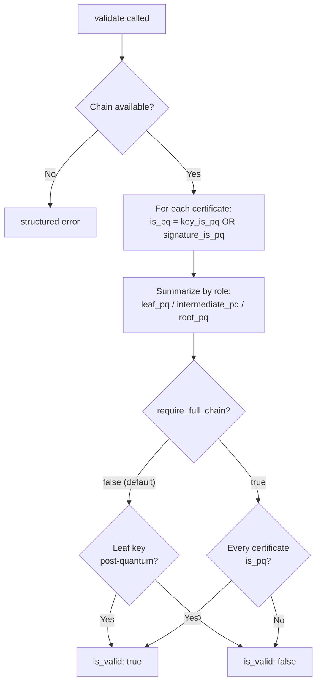

# PqChain Validator

Reports the **post-quantum posture of every certificate in the presented
chain**. During the staged PQ migration the leaf, intermediates, and root
rotate independently, so a single yes/no for the whole chain hides the
information operators actually need. This validator gives a per-certificate
view plus a role-level summary.

A certificate counts as PQ when **either** its public key algorithm or
its signature algorithm is post-quantum (standalone ML-DSA/SLH-DSA or a
composite). The signature is the issuing CA's choice rather than the
operator's, so both are tracked separately per link.

By default `is_valid: true` means **the leaf certificate's key is
post-quantum** (the part the operator controls). Pass
`require_full_chain: true` via validator args to require that every presented certificate has a PQ key **or** a PQ signature. This does not require both on each certificate or verify the signatures.

!!! note "The server may omit the root"
    This report covers the presented chain, not a path built against a trust store. A missing root produces `root_pq: null`. A classical root, when present, is a separate migration finding; it does not change the default leaf-key policy.

## Opt-in

Registered but **disabled by default** (not in `DEFAULT_VALIDATORS`):

```python
from certmonitor import CertMonitor

with CertMonitor("example.com", enabled_validators=["pq_chain"]) as m:
    print(m.validate()["pq_chain"])

# strict mode:
#   m.validate(validator_args={"pq_chain": {"require_full_chain": True}})
```

Chain retrieval uses the same APIs and fallbacks as the [Chain](chain.md) validator. If the server's chain cannot be retrieved or parsed, you get a structured error instead of the report below. Missing issuers are not downloaded.

## How it decides

Each link is classified independently, then the verdict keys off the leaf
key by default (or the whole chain with `require_full_chain`).



## Example output

A post-quantum leaf on a classical chain (one possible migration shape):

These examples show selected fields from illustrative scans. `validate()` also adds `status` and `code`, described in the [result contract](index.md#the-result-contract).

```json
{
    "chain_length": 3,
    "certs": [
        {"position": 0, "role": "leaf", "subject": {"commonName": "example.com"}, "key_algorithm": "ml-dsa-65",
         "key_is_pq": true, "signature_algorithm_oid": "1.2.840.113549.1.1.11",
         "signature_is_pq": false, "is_pq": true},
        {"position": 1, "role": "intermediate", "subject": {"commonName": "Intermediate CA"}, "key_algorithm": "rsaEncryption",
         "key_is_pq": false, "signature_is_pq": false, "is_pq": false},
        {"position": 2, "role": "root", "subject": {"commonName": "Root CA"}, "key_algorithm": "rsaEncryption",
         "key_is_pq": false, "signature_is_pq": false, "is_pq": false}
    ],
    "summary": {"leaf_pq": true, "intermediate_pq": false, "root_pq": false},
    "is_valid": true
}
```

`summary` values are `null` for roles with no certificate in the chain
(e.g. a single self-signed cert has no intermediates).

## Reference

::: certmonitor.validators.pq_chain.PqChainValidator
