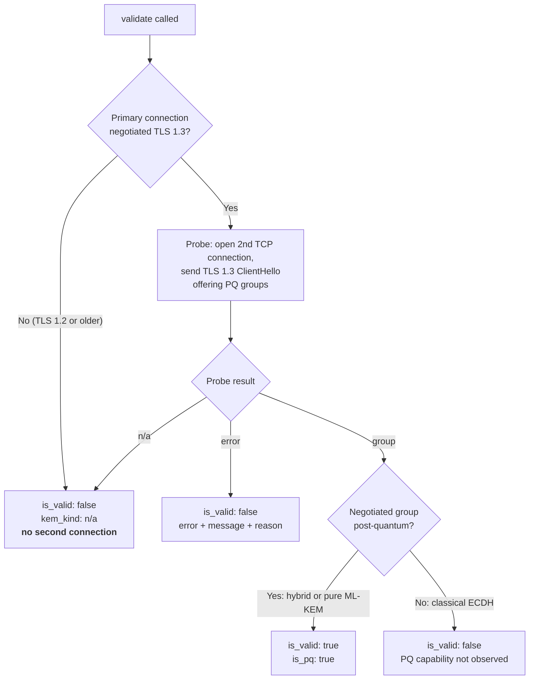

# PqKeyExchange Validator

Reports the **post-quantum capability observed in a TLS probe**, useful
when assessing *harvest-now-decrypt-later* (HNDL) readiness. It does not
establish protection of the primary session or application traffic.

It consumes the negotiated cipher info plus a second-connection TLS probe
(`certinfo.probe_tls_handshake`) that reads the selected or requested TLS 1.3
key-exchange group off the wire, something the Python `ssl` module does
not expose.

"PQ" includes **hybrid** groups (classical + ML-KEM, e.g.
`X25519MLKEM768`) as well as pure ML-KEM; a hybrid result is therefore sufficient for this validator's PQ classification. `is_valid` is a strict `bool`.

## Opt-in

Registered but **disabled by default** (not in `DEFAULT_VALIDATORS`).
Enable it explicitly:

```python
from certmonitor import CertMonitor

with CertMonitor("example.com", enabled_validators=["pq_key_exchange"]) as m:
    print(m.validate()["pq_key_exchange"])
```

or via `ENABLED_VALIDATORS=...,pq_key_exchange`.

## Behavior

| Server | Result |
|---|---|
| TLS 1.3 + hybrid/pure PQ group | `is_valid: true` |
| TLS 1.3 + classical group | `is_valid: false` (PQ capability not observed under this offer) |
| TLS 1.2 or older | `is_valid: false`, `status: unsupported` |
| Connection / probe error / TLS alert | `{error, message, is_valid: false}` |

**Skip-for-legacy:** the probe opens a second TCP connection only when the
primary connection negotiated TLS 1.3. For TLS 1.2 and older the result
is determined without any extra connection.

**Second connection:** when it does run, the probe is a separate TCP
connection to the host; IDS/rate-limiters may observe it. This is one
reason the validator is opt-in. It stops at ServerHello or HelloRetryRequest,
without completing or authenticating the handshake. Results include endpoint,
observation time, offered groups, `handshake_completed: false`, and
`authenticated: false`. `via_hello_retry_request` identifies a requested
group. When `connection_host` and `server_hostname` differ, the probe connects
to the address and offers the SNI name, the same split the trust check uses.

## How it decides



## Example output

Hybrid PQ (pass):

These examples show selected fields from illustrative scans. `validate()` also adds `status` and `code`, described in the [result contract](index.md#the-result-contract).

```json
{
    "observation_scope": "server_capability_probe",
    "handshake_completed": false,
    "authenticated": false,
    "endpoint": "cloudflare.com:443",
    "observed_at": "2026-09-06T00:26:21.588128+00:00",
    "offered_groups": [
        4588,
        29,
        23
    ],
    "kem_id": 4588,
    "kem_name": "X25519MLKEM768",
    "kem_kind": "hybrid_pq",
    "is_pq": true,
    "is_valid": true
}
```

Classical (fail):

```json
{
    "observation_scope": "server_capability_probe",
    "handshake_completed": false,
    "authenticated": false,
    "endpoint": "legacy.example.net:443",
    "observed_at": "2026-09-05T12:00:00+00:00",
    "offered_groups": [
        4588,
        29,
        23
    ],
    "kem_id": 29,
    "kem_name": "x25519",
    "kem_kind": "classical_ecdh",
    "is_pq": false,
    "is_valid": false,
    "reason": "This probe selected classical key exchange (x25519); PQ capability was not observed with this offer."
}
```

## Reference

::: certmonitor.validators.pq_key_exchange.PqKeyExchangeValidator
