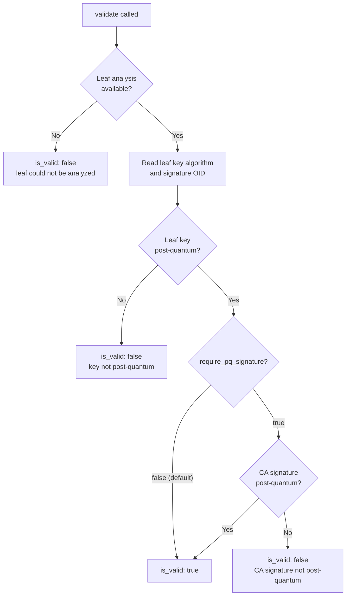

# PqSignature Validator

Reports the **post-quantum posture of the leaf certificate** — the
certificate the server presents for itself. The public key algorithm and
the signature algorithm are judged separately because they migrate
separately: the key is the operator's choice, while the signature is
applied by the issuing CA.

A hybrid **composite** algorithm (one identifier standing for a
post-quantum and a classical algorithm used together) counts as
post-quantum and is additionally flagged via `is_hybrid_composite`.

By default `is_valid: true` means **the leaf key is post-quantum** — the
part the operator controls — matching the `pq_chain` default so a
PQ-keyed, classically-signed certificate (the realistic migration shape)
gets one consistent verdict across validators. Pass
`require_pq_signature: true` via validator args to additionally demand a
post-quantum signature from the CA.

Unlike the chain validators, this works on **every supported
interpreter**: the leaf data comes from the chain analysis when
available, with a leaf-only fallback otherwise (the leaf certificate is
always in hand).

## Opt-in

Registered but **disabled by default** (not in `DEFAULT_VALIDATORS`):

```python
from certmonitor import CertMonitor

with CertMonitor("example.com", enabled_validators=["pq_signature"]) as m:
    print(m.validate()["pq_signature"])

# strict mode:
#   m.validate(validator_args={"pq_signature": {"require_pq_signature": True}})
```

## How it decides

The key and the signature are judged separately; `is_valid` keys off the
leaf **key** by default (the part the operator controls).



`is_pq` (reported separately from `is_valid`) is true when **either** the
key or the signature is post-quantum.

## Example output

A post-quantum leaf, classically signed (the realistic migration shape):

```json
{
    "key_algorithm": "ml-dsa-65",
    "key_is_pq": true,
    "signature_algorithm_oid": "1.2.840.113549.1.1.11",
    "signature_is_pq": false,
    "is_hybrid_composite": false,
    "is_pq": true,
    "is_valid": true
}
```

A classical leaf:

```json
{
    "key_algorithm": "rsaEncryption",
    "key_is_pq": false,
    "signature_algorithm_oid": "1.2.840.113549.1.1.11",
    "signature_is_pq": false,
    "is_hybrid_composite": false,
    "is_pq": false,
    "is_valid": false,
    "reason": "Leaf key algorithm (rsaEncryption) is not post-quantum."
}
```

::: certmonitor.validators.pq_signature.PqSignatureValidator
